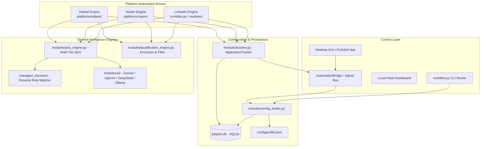
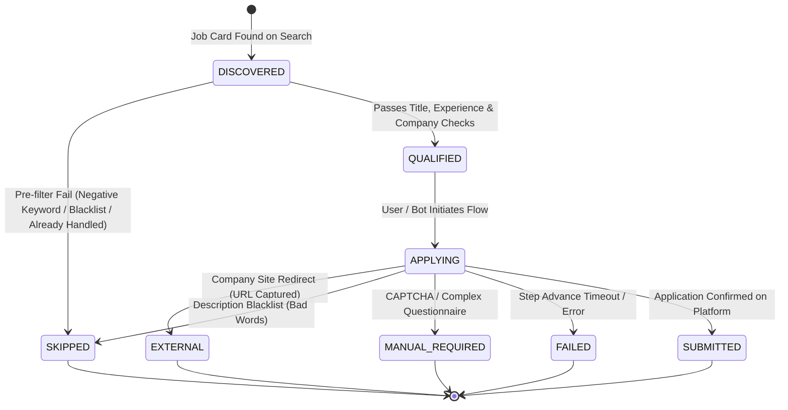
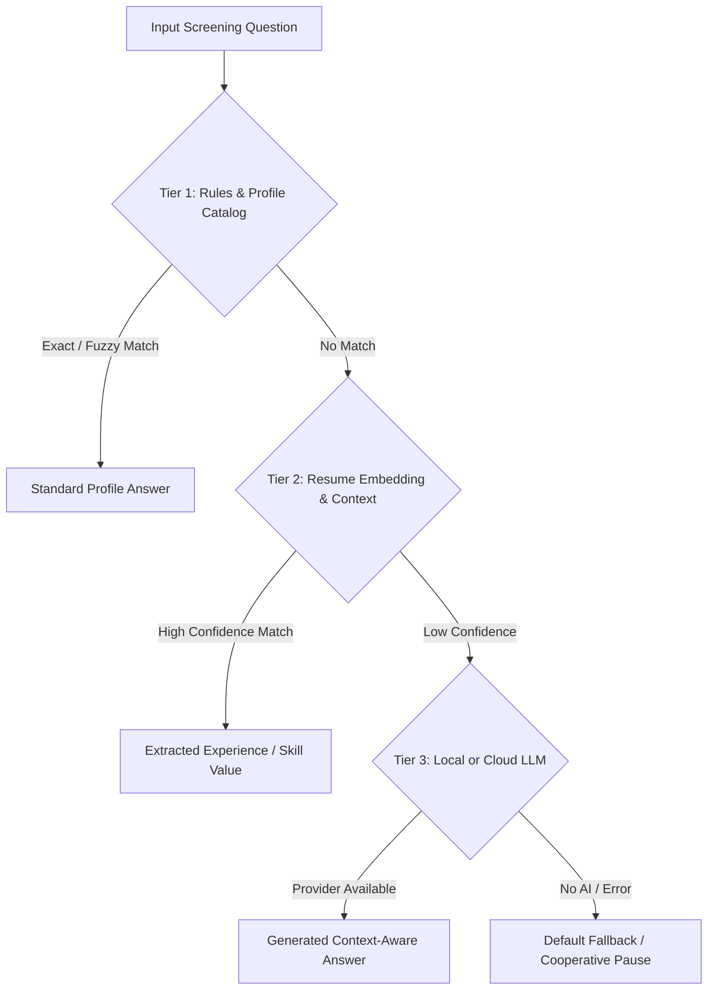
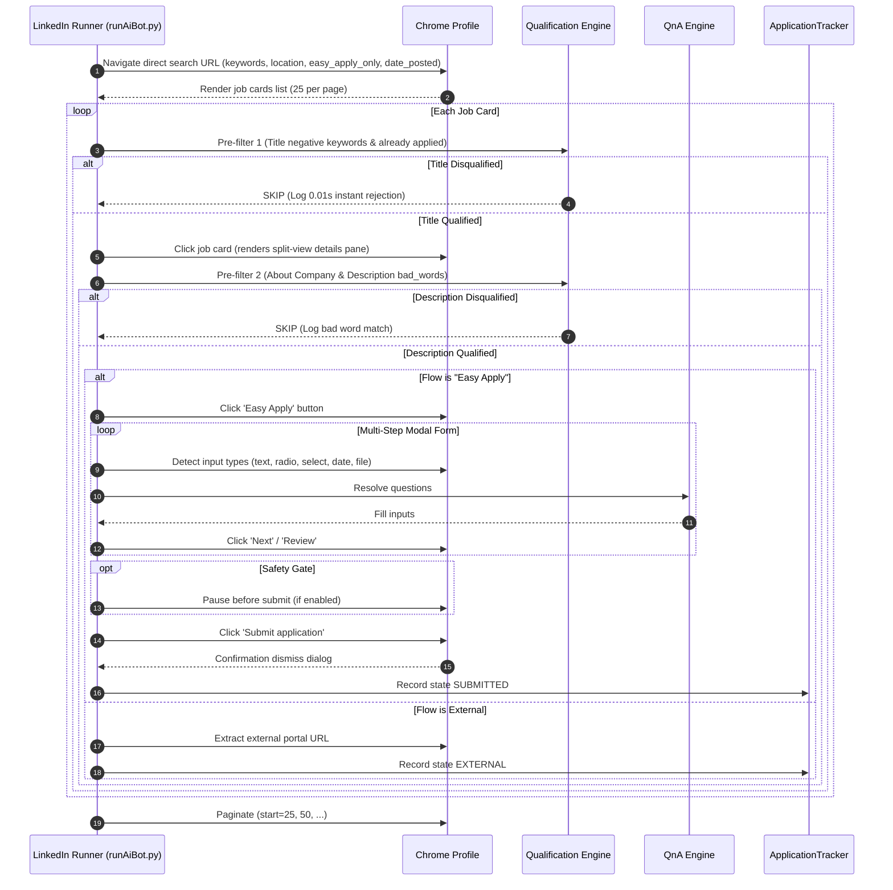
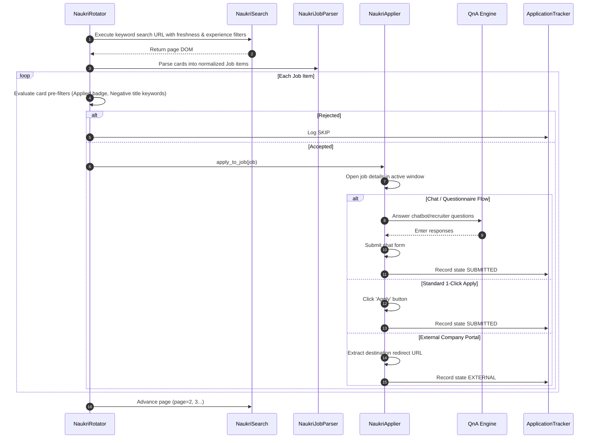
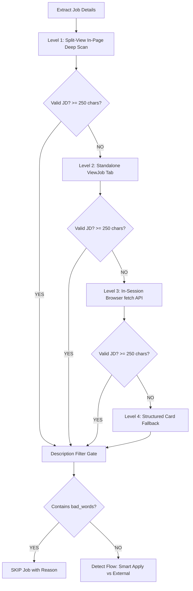
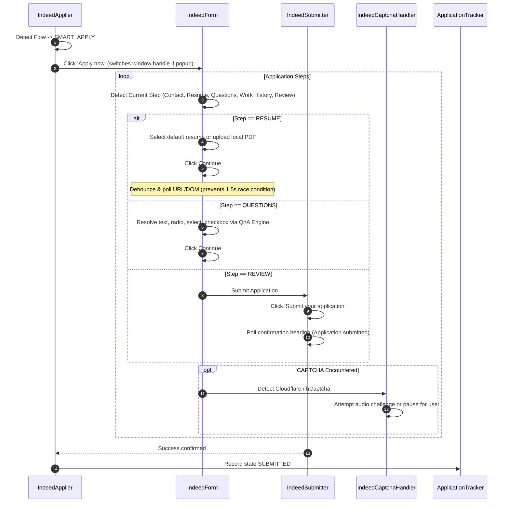

# JobPilot — Automation Architecture, Functional Workflows & Platform Specifications

This document serves as the canonical technical reference for the multi-platform job automation architecture within **JobPilot** (covering **LinkedIn**, **Indeed**, and **Naukri**). It details the architectural models, detection engines, multi-tier QnA resolution, anti-detection strategies, lifecycle states, and platform-specific implementations for future engineering and maintenance.

---

## 1. System High-Level Architecture

The automation subsystem operates as an asynchronous, headless or windowed execution engine controlled via CLI (`runAiBot.py`), local Flask dashboard (`app.py`), or PySide6 Desktop GUI (`run_desktop.py`).

---

## 2. Core Shared Subsystems

### 2.1 Configuration Architecture
Configuration is hierarchical with database synchronization:
1. **SQLite Database (`platform_accounts.extra_settings`)**: Single source of truth when running the Desktop UI.
2. **`config/profile.json`**: Master JSON configuration holding personal details, standard QnA answers, credentials, and platform search settings.
3. **Legacy Python Configs (`config/search.py`, `config/questions.py`, `config/settings.py`)**: Preserved for backward compatibility, automatically populated by `modules/config_loader.py`.

### 2.2 Unified Job & Application Lifecycle
Job opportunities and user applications are decoupled into distinct entities:
- **`Job`**: Discovered posting on a portal (title, company, URL, raw metadata, description, salary, experience requirements).
- **`Application`**: Candidate's interaction record (status, attempt timestamps, answers submitted, failure reason).

### 2.3 Exclusion & Skip Filters
Filtering is executed at two distinct evaluation gates:

| Gate Level | Method / Field | Timing | Latency | Rules Evaluated |
|---|---|---|---|---|
| **Gate 1: Instant Skip (Title & Company)** | `qualify_title()` / `negative_title_words` | Before clicking or opening card | ~0.01s | Exact word-boundary regex (`\b{term}\b`), company blacklists (`about_company_bad_words`), already applied check. |
| **Gate 2: Description Filter** | `qualify_description()` / `bad_words` | Immediately after JD extraction | ~0.05s | Blacklisted phrases (`US Citizen`, `Security Clearance`, `Polygraph`, `No C2C`), required experience thresholds, core domain skill mismatch. |

### 2.4 Multi-Tier QnA Resolution Engine
Screening questions encountered in application dialogs are resolved across 3 deterministic tiers before user escalation:

- **Tier 1 (Catalog & Exact Rules)**: Looks up normalized keys in `config/canonical_qna_catalog.json` and `config/profile.json` (e.g. visa sponsorship, citizenship, notice period, expected CTC, years with Python/SQL).
- **Tier 2 (Resume Semantic Match)**: Scans active candidate resume sections for dates, certifications, tools, and quantified accomplishments.
- **Tier 3 (AI Inference Hub)**: Uses Ollama (`llama3`/`mistral`), OpenAI (`gpt-4o-mini`), DeepSeek, or Google Gemini with prompts restricted strictly to factual candidate profile data.

---

## 3. Platform 1: LinkedIn Automation

### 3.1 Architectural Overview
- **Location**: `runAiBot.py`, `modules/clickers_and_finders.py`, `modules/open_chrome.py`.
- **Driver Runtime**: `undetected-chromedriver` with persistent profile directory `~/.jobpilot-chrome-profile` (fallback to `~/.apply-and-pray-chrome-profile`).
- **Page Load Strategy**: `options.page_load_strategy = 'eager'` combined with `safe_driver_get(driver, url, timeout)` to prevent hanging LinkedIn WebSocket connections.

### 3.2 Workflow & Features

### 3.3 Key Technical Features
1. **Direct Search URL Construction**: Bypasses fragile UI modal clicks by pre-encoding all query parameters (`f_AL=true`, `f_TPR=r604800`, `f_E=2,3`, `geoId=...`).
2. **Modal Form Resiliency**: Handles multi-page dialogs with Next, Review, Dismiss buttons, phone country code normalization, unchecking unwanted follow-company checkboxes.
3. **Session Rotation Safety**: Enforces `switch_number` (default 25–30 applications) per search term to avoid LinkedIn heuristic bot triggers.

---

## 4. Platform 2: Naukri.com Automation

### 4.1 Architectural Overview
- **Location**: `platforms/naukri/` (`rotator.py`, `applier.py`, `search.py`, `parser.py`, `selectors.py`).
- **Driver Runtime**: Persistent profile directory `~/.jobpilot-naukri-profile`.
- **Authentication**: Seamless SSO session retention using persistent user data directory.

### 4.2 Workflow & Features

### 4.3 Key Technical Features
1. **Chatbot Questionnaire Handling**: Dedicated support for Naukri's modern recruiter chatbot overlays (dynamic step answers for CTC, notice period, location willingness, skills).
2. **Parsed Metadata Extraction**: Regex parsing of salary bands (e.g. `5-10 Lacs P.A.`), experience bounds (`2-5 Yrs`), and recruiter contact details.
3. **Direct vs External Portal Segregation**: Accurately tracks jobs redirected to employer portals versus direct Naukri applications.

---

## 5. Platform 3: Indeed Automation

### 5.1 Architectural Overview
- **Location**: `platforms/indeed/` (`rotator.py`, `applier.py`, `search.py`, `form.py`, `submitter.py`, `safety_gate.py`, `captcha_handler.py`, `selectors.py`).
- **Driver Runtime**: Persistent profile directory `~/.jobpilot-indeed-profile`.
- **Search Domain**: `https://in.indeed.com` (configurable for global locales).

### 5.2 Multilevel Job Description (JD) Extraction Pipeline
Indeed dynamically varies listing presentation (split-view panes, iframes, standalone `/viewjob` pages, client-side React rendering). The applier uses a 4-level extraction pipeline gated by strict validation:

- **Validation Gate (`is_valid_job_description`)**: Enforces $\ge 250$ characters, rejects error stubs, loading stubs, and cookie notices.
- **Level 1 (In-Page Split-View)**: In-page JS traversal checking `<script type="application/ld+json">`, primary `#jobDescriptionText` containers, and semantic headings.
- **Level 2 (Standalone `/viewjob` Tab)**: Opens temporary background tab at `https://in.indeed.com/viewjob?jk={job_id}`, extracts server-rendered JSON-LD and `window._initialData`, then safely closes tab.
- **Level 3 (In-Session `fetch()`)**: Executes authenticated `fetch('/viewjob?jk={job_id}')` directly within browser context and parses HTML without UI navigation.
- **Level 4 (Card Summary Fallback)**: Synthesizes a structured fallback summary from job card attributes.

### 5.3 Smart Apply Multi-Step Form Automation

### 5.4 Form Transition Debounce & Resilient Navigation
- **Race Condition Prevention**: Indeed takes ~1.5–2.0 seconds to transition the DOM after clicking Continue on the Resume step. The engine employs step debouncing: if the detected step is identical to the previous step and the URL has not changed, it pauses briefly to allow React DOM re-rendering.
- **Resilient Selectors**: Case-insensitive XPaths (`translate(., ...)`, `continue`, `next`, `review`), test IDs (`continue-button`, `SmartApplyForm-continueButton`), and smart JavaScript click fallbacks.

---

## 6. Functional Comparison Across Platforms

| Feature / Capability | LinkedIn Automation | Naukri.com Automation | Indeed Automation | Foundit Automation |
|---|---|---|---|---|
| **Runtime Driver** | `undetected-chromedriver` | `undetected-chromedriver` | `undetected-chromedriver` | `undetected-chromedriver` |
| **Profile Isolation** | `~/.jobpilot-chrome-profile` | `~/.jobpilot-naukri-profile` | `~/.jobpilot-indeed-profile` | `~/.jobpilot-foundit-profile` |
| **Search Mechanism** | Direct query-param URL | Direct search URL + pagination | Keyword rotation + auto-relax date | 15-card offset pagination (`start=(page-1)*15`) |
| **Instant Title Skip** | Regex `\b{neg}\b` (0.01s) | `qualify_title()` (0.01s) | Pre-filter 1b regex `\b{neg}\b` (0.01s) | Stage 1 `qualify_job_pre_click()` (0.01s) |
| **Description Skip** | `bad_words` pre-click scan | `qualify_description()` post-click | `bad_words` post-JD extraction | Stage 2 `qualify_job_post_click()` (0.05s) |
| **JD Extraction** | Split-view container selector | Main listing DOM parser | 4-Level Pipeline (In-Page, Tab, Fetch, Fallback) | 5-Level Hierarchy from Right Pane (`detailsContainer`) |
| **JD Validation Gate** | Minimum length check | Container presence check | Strict Gate ($\ge 250$ chars + stub filter) | Validated Gate ($\ge 60$ chars + stub filter) |
| **Native Apply Mode** | Easy Apply dialog | 1-Click Apply & Chatbot Apply | Smart Apply multi-step modal | 1-Click Direct Apply & Questionnaire modal |
| **External Portal Jobs** | Captured & tagged `EXTERNAL` | Captured & tagged `EXTERNAL` | Captured & tagged `EXTERNAL` | Captured & tagged `EXTERNAL` (`_blank` / external) |
| **QnA Engine Integration** | Tier 1-3 QnA Pipeline | Tier 1-3 QnA Pipeline | Tier 1-3 QnA Pipeline | Tier 1-3 QnA Pipeline (text, select, radio) |
| **Resume Handling** | Selects existing / uploads PDF | Uses profile default CV | Selects existing / uploads PDF | Profile CV + PDF file upload input |
| **Captcha Handling** | Session checkpoint alert | Session checkpoint alert | Audio solver + UI cooperative pause | Cloudflare / Turnstile detection + cooperative pause |
| **Desktop GUI Signals** | WebSocket / Qt Signals | WebSocket / Qt Signals | WebSocket / Qt Signals | `AutomationBridge` Qt Signals & SQLite sync |

---

## 7. Future Development Guidelines & Extension Points

When extending or modifying the automation engines, adhere to the following principles:

1. **Keep Models Decoupled**:
   Never alter the core `Job` and `Application` models in `modules/models.py` without updating migrations in `migrate_config_to_db.py`.
2. **Gate Validation Before AI**:
   Always run fast title exclusion (0.01s) and description blacklist checking *before* invoking LLM/AI endpoints to minimize latency and token consumption.
3. **DOM Transition Safety**:
   When automating single-page applications (React/Next.js on Indeed and LinkedIn), always poll for transition state changes (URL change, spinner detachment, or container mutability) rather than using fixed sleep intervals.
4. **Cooperative Interruption**:
   Every loop iteration across search cards or form steps must check `if stop_check and stop_check(): break` to allow immediate, graceful stopping from the Desktop UI.
5. **Anti-Bot Hygiene**:
   Preserve human-like delays (1.0–2.5s jitter), eager page loading, and persistent browser profiles. Never run concurrent driver instances against the same Chrome user profile directory.
