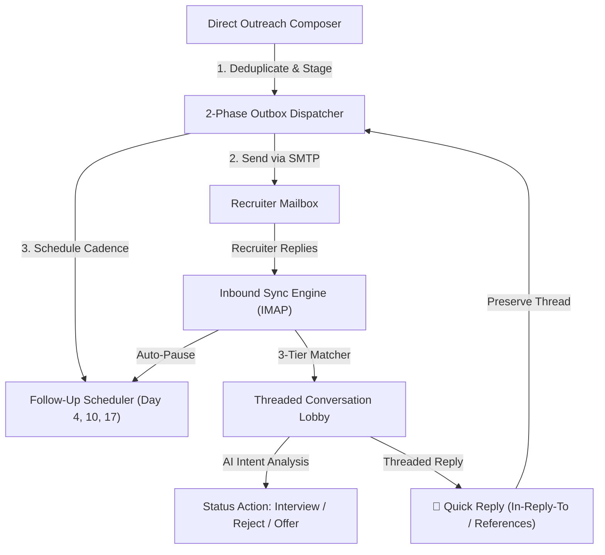

# JobPilot Outreach Center — Feature & Architecture Specification

## 1. Executive Overview

The **Outreach Center** is a first-class ATS-grade email outreach, communication tracking, and automated recruiter cadence engine embedded within the **JobPilot** desktop ecosystem. 

Rather than functioning as a rudimentary "fire-and-forget" email client, the Outreach Center establishes a closed-loop candidate-to-recruiter relationship pipeline:

---

## 2. Core Feature Inventory & Functional Breakdown

### Feature 1: Mail Provider & Credential Management Layer
* **Files:** [`app/services/email/smtp_imap_provider.py`](file:///home/ahmad10raza/Documents/Mastering/Apply-and-Pray/app/services/email/smtp_imap_provider.py), [`app/services/email/factory.py`](file:///home/ahmad10raza/Documents/Mastering/Apply-and-Pray/app/services/email/factory.py), [`app/services/secrets_service.py`](file:///home/ahmad10raza/Documents/Mastering/Apply-and-Pray/app/services/secrets_service.py)
* **Description:** Connects the desktop application to actual production email providers (Gmail, Outlook, custom corporate SMTP/IMAP).
* **Capabilities:**
  1. **Dual Protocol Support:** Synchronous RFC 2822 SMTP message transmission with SSL/TLS and IMAP SSL mailbox synchronization.
  2. **Security & Credential Decoupling:** Credentials (`sender_name`, `username`, `app_password`, `smtp_host`, `smtp_port`, `imap_host`, `imap_port`) are managed via `SecretsService` and stored securely in `config/profile.json` (gitignored).
  3. **Zero-Freeze Pre-Flight Diagnostic Worker:** `EmailTestWorker(QThread)` in `SettingsView` tests both outbound SMTP and inbound IMAP connections in a background thread, preventing UI lockups.
  4. **Actionable Diagnostic Error Popups:** Maps raw SMTP exception codes to human-readable troubleshooting guidance:
     * `530 Authentication Required`: Prompts to verify App Passwords and envelope addresses.
     * `535 Authentication Unsuccessful`: Provides direct links to Google/Microsoft App Password generators.
     * `Timeout / Connection Refused`: Pinpoints host and port misconfigurations.

---

### Feature 2: Direct Outreach Composer
* **Files:** [`app/ui/views/outreach_view.py`](file:///home/ahmad10raza/Documents/Mastering/Apply-and-Pray/app/ui/views/outreach_view.py#L150), [`app/services/template_renderer.py`](file:///home/ahmad10raza/Documents/Mastering/Apply-and-Pray/app/services/template_renderer.py)
* **Description:** A dedicated modal dialog (`+ Direct Outreach`) designed for composing high-conversion personalized emails to recruiters.
* **Capabilities:**
  1. **Recruiter & Job Context Selection:** Inputs for target Company, Job Title, Recruiter Name, and Recruiter Email with immediate syntax validation.
  2. **Candidate Resume Lineage & Versioning:** Dropdown listing candidate resumes with exact version labels (`[v1.0]`, `[v2.0]`), target roles, and file paths.
  3. **Dynamic Template Catalog:** Pre-seeded templates (e.g., *Direct Recruiter Pitch*, *Follow-up Cadence*, *Portfolio Showcase*) with mustache-style variable interpolation (`{{candidate_name}}`, `{{company_name}}`, `{{job_title}}`).
  4. **AI Pitch Generation:** `AIPitchWorker(QThread)` interfaces with `OutreachAIService` to draft tailored outreach pitches matching the target job description.
  5. **Automated Cadence Enrollment:** Checkboxes allowing the candidate to configure automated 3-step follow-up schedules (Day 4, Day 10, Day 17).

---

### Feature 3: Two-Phase Outbox Dispatcher & Deduplication Engine
* **Files:** [`app/services/outreach_dispatcher.py`](file:///home/ahmad10raza/Documents/Mastering/Apply-and-Pray/app/services/outreach_dispatcher.py), [`app/services/outreach_service.py`](file:///home/ahmad10raza/Documents/Mastering/Apply-and-Pray/app/services/outreach_service.py)
* **Description:** Ensures reliable, idempotent email sending using transactional database staging.
* **Capabilities:**
  1. **Duplicate Detection:** Checks previous applications across 3 tiers:
     * *Tier 1:* Existing application for the exact same contact email.
     * *Tier 2:* Application at the same company for the same job title within 30 days.
     * *Tier 3:* Open application with pending follow-ups.
     * Offers an override modal if the user explicitly chooses to proceed.
  2. **Two-Phase Commit Protocol:**
     * *Phase 1 (Staging):* Creates an `Application`, stages `Communication` with status `SENDING`, snapshots the attached PDF resume into `data/staged_attachments/`, and generates a unique `send_token`.
     * *Phase 2 (Remote Dispatch):* Transmits the email via SMTP. On success, commits `Communication.status = SENT` and registers `provider_message_id`.
  3. **Startup Reconciliation:** `reconcile_startup_outreach()` scans on boot for any orphaned `SENDING` messages older than 5 minutes and flags them for recovery.

---

### Feature 4: Automated Follow-Up Cadence Scheduler
* **Files:** [`app/services/followup_scheduler.py`](file:///home/ahmad10raza/Documents/Mastering/Apply-and-Pray/app/services/followup_scheduler.py)
* **Description:** Manages multi-step follow-up schedules so candidate outreach doesn't go cold.
* **Capabilities:**
  1. **Deterministic Cadence Schedule:** Dispatched applications automatically schedule:
     * *Step 1:* Gentle follow-up (applied date + 4 days).
     * *Step 2:* Additional context / value proposition (applied date + 10 days).
     * *Step 3:* Final break-up email (applied date + 17 days).
  2. **Status Lifecycles:** Transitions follow-ups across `PENDING` -> `DUE` -> `COMPLETED` / `PAUSED`.
  3. **Automatic Reply-Kill Safety Invariant:** When an inbound reply is detected from the recruiter, **all pending follow-ups are instantly paused** (`FollowUp.status = PAUSED`, `reason = 'Recruiter replied'`).
  4. **Manual Cadence Controls:** Candidates can pause or resume follow-ups at any time via the UI, or execute an upcoming step early with `"⚡ Execute Now"`.

---

### Feature 5: Inbound Mailbox Sync & 3-Tier Matcher
* **Files:** [`app/services/inbound_sync_service.py`](file:///home/ahmad10raza/Documents/Mastering/Apply-and-Pray/app/services/inbound_sync_service.py)
* **Description:** Background IMAP polling engine that ingests incoming emails, matches recruiter replies to existing applications, and downloads attachments.
* **Capabilities:**
  1. **Spam & Newsletter Immunization:** `IGNORED_SENDER_PATTERNS` immediately filters out automated job boards, digests, and no-reply addresses (`jobalert.indeed.com`, `messages-noreply@linkedin.com`, `donotreply@`, etc.).
  2. **Heuristic Match Engine (3 Tiers):**
     * **Tier 1 (Thread Header Match):** Matches RFC 2822 `In-Reply-To` or `References` against existing `Communication.provider_message_id`.
     * **Tier 2 (Sender Email Match):** Matches recruiter's email against existing `Contact.email` under open applications.
     * **Tier 3 (Subject / Company Domain Match):** Matches subject tokens (e.g., `Re: Application: RPA Developer`) and domain names.
  3. **Attachment Downloader:** Automatically extracts incoming PDF and DOCX attachments (e.g., offer letters, take-home tasks, job specs) and stores them under `data/attachments/`.

---

### Feature 6: Outreach Center UI & Conversation Command Center
* **Files:** [`app/ui/views/outreach_view.py`](file:///home/ahmad10raza/Documents/Mastering/Apply-and-Pray/app/ui/views/outreach_view.py)
* **Description:** Obsidian-styled split-pane command center (`#0F1117`, `#161B22`, `#FF5F15`).
* **Capabilities:**
  1. **KPI Metric Strip:** Real-time counters for *Total Outreached*, *Awaiting Reply*, *Recruiter Replied*, and *Cadences Due*.
  2. **Conversation Lobby & Filter Pills:**
     * `ALL`: Complete active email applications.
     * `WAITING`: Awaiting initial recruiter response.
     * `REPLIED`: Recruiter has replied to the thread.
     * `ACTION`: Automated follow-up due or AI recommended action.
     * Real-time search by company, job title, or recruiter name.
  3. **Communication History Stream:**
     * Outbound candidate messages highlighted with orange accents.
     * Inbound recruiter replies highlighted with blue accents.
     * Resume badge: Displays attached resume version with direct `[👁 View Sent Resume]` file viewer.
     * Recruiter attachment badge: Direct `[📂 Open Attachment]` button to inspect received files.
     * Expandable long messages with non-blocking `[📖 Read Full Message ▼]` / `[▲ Show Less]` toggle.
  4. **AI Intent Classification Banner:** Analyzes incoming recruiter messages (e.g. *Interview Invitation*, *Salary Question*, *Rejection*) and presents a 1-click `"✓ Apply Status"` button.

---

### Feature 7: Threaded Conversation Reply System
* **Files:** [`app/services/outreach_service.py`](file:///home/ahmad10raza/Documents/Mastering/Apply-and-Pray/app/services/outreach_service.py#L202), [`app/ui/views/outreach_view.py`](file:///home/ahmad10raza/Documents/Mastering/Apply-and-Pray/app/ui/views/outreach_view.py#L1275)
* **Description:** Enables candidates to reply directly to a recruiter within an existing email thread.
* **Capabilities:**
  1. **Direct In-Thread Composer:** Embedded quick-reply card docked under the conversation stream.
  2. **RFC 2822 Thread Preservation:** Automatically injects `In-Reply-To` and `References` headers referencing the recruiter's message ID and prefixes subject with `Re: `.
  3. **Dynamic Sender Resolution:** Automatically binds the primary candidate user profile (`Candidate <candidate@example.com>`).
  4. **Asynchronous Dispatch:** Dispatches via `ReplySendWorker(QThread)` so the desktop GUI remains responsive during SMTP handshakes.
  5. **In-Place Thread Appending:** The new reply is appended to the existing conversation timeline immediately upon successful transmission.

---

## 3. Database Schema & Data Models

| Model | Table | Purpose in Outreach Center |
|---|---|---|
| [`Application`](file:///home/ahmad10raza/Documents/Mastering/Apply-and-Pray/app/db/models/application.py) | `applications` | Master record for the outreach target. Holds company, role, target resume, status, and notes. |
| [`Contact`](file:///home/ahmad10raza/Documents/Mastering/Apply-and-Pray/app/db/models/contact.py) | `contacts` | Recruiter profile (name, email, designation, phone, company relation). |
| [`Communication`](file:///home/ahmad10raza/Documents/Mastering/Apply-and-Pray/app/db/models/communication.py) | `communications` | Discrete message record (`INBOUND` / `OUTBOUND`). Stores subject, body snippet, summary, attachment path, and `provider_message_id`. |
| [`FollowUp`](file:///home/ahmad10raza/Documents/Mastering/Apply-and-Pray/app/db/models/follow_up.py) | `follow_ups` | Scheduled cadence step. Stores `step_number`, `due_at`, `status` (`PENDING`, `DUE`, `PAUSED`, `COMPLETED`), and `paused_reason`. |
| [`Resume`](file:///home/ahmad10raza/Documents/Mastering/Apply-and-Pray/app/db/models/resume.py) | `resumes` | Resume file reference. Stores version string (`1.0`), file path, target role, and SHA-256 hash. |
| [`EmailTemplate`](file:///home/ahmad10raza/Documents/Mastering/Apply-and-Pray/app/db/models/email_template.py) | `email_templates` | Pre-built email templates with variable substitution placeholders. |

---

## 4. API & Service Architecture Reference

### Service Methods (`OutreachService`)

| Method | Parameters | Return Type | Description |
|---|---|---|---|
| `send_outreach()` | `dto: OutreachCreateDTO` | `Dict[str, Any]` | Executes 2-phase outbox dispatch for fresh direct outreach. |
| `send_reply()` | `application_id: int, body_text: str, subject: Optional[str]` | `Dict[str, Any]` | Dispatches threaded reply email using existing conversation context and headers. |
| `list_conversations()` | `state_filter: Optional[str], limit: int` | `List[Dict[str, Any]]` | Queries all active email applications and compiles aggregated conversation states. |
| `get_conversation_timeline()` | `application_id: int` | `Dict[str, Any]` | Resolves full communication stream, resume details, attachments, and cadences. |
| `pause_followups()` | `application_id: int, reason: str` | `int` | Pauses all pending follow-up steps for an application. |
| `resume_followups()` | `application_id: int` | `int` | Unpauses follow-up cadence. |
| `get_outreach_stats()` | *None* | `Dict[str, Any]` | Computes KPI counts for dashboard headers. |
| `test_provider_connection()` | `account_id: str` | `ConnectionStatusDTO` | Validates SMTP and IMAP network reachability and credentials. |

### REST Endpoints (`app.py`)

* `GET /api/outreach/stats` — High-level metric counts.
* `GET /api/outreach/conversations` — Active conversation list with state filtering.
* `GET /api/outreach/conversations/<id>/timeline` — Full message stream and cadence schedule.
* `POST /api/outreach/conversations/<id>/pause` — Pauses follow-ups.
* `POST /api/outreach/conversations/<id>/resume` — Resumes follow-ups.
* `POST /api/outreach/send` — Direct outreach dispatch endpoint.
* `GET /api/outreach/templates` — List template catalog.
* `POST /api/outreach/templates/preview` — Interpolates template with candidate context.
* `POST /api/outreach/sync` — Triggers on-demand IMAP mailbox synchronization.
* `POST /api/outreach/provider/test` — Tests email connectivity.

---

## 5. Typical User Workflows

### Scenario A: Sending a New Direct Outreach
1. Open JobPilot Desktop and click **Outreach Center** in the navigation bar.
2. Click **"+ Direct Outreach"** in the top action bar.
3. Enter the Company Name, Job Title, and Recruiter Email.
4. Select the target Resume Version from the dropdown.
5. Either click **"✨ Generate Pitch"** for AI assistance or select a pre-configured template.
6. Click **"Send Outreach"**. The email is delivered, an application record is created, and follow-ups are automatically scheduled.

### Scenario B: Synchronizing Inbound Responses
1. In the Outreach Center, click **"🔄 Sync Inbound"**.
2. A background worker connects to your IMAP server, ingests incoming messages, filters automated newsletters, and links recruiter replies to matching applications.
3. Any application receiving a recruiter reply automatically transitions to **`REPLIED`** status and its follow-ups are paused.

### Scenario C: Replying Directly in the Same Conversation Thread
1. Click the application in the conversation lobby on the left.
2. Review the message history and any attachments.
3. In the **"💬 Reply to Recruiter (Threaded)"** composer at the bottom of the stream, type your response.
4. Click **"✉️ Send Reply (Threaded)"**. The reply is dispatched using proper `In-Reply-To` threading and appended directly to the conversation.

---

## 6. Outreach Operations V2 Overhaul (High-Capacity Work Queue & Bulk Engine)

Implemented under [`WorkingFlow/OutreachV2.md`](file:///home/ahmad10raza/Documents/Mastering/Apply-and-Pray/WorkingFlow/OutreachV2.md) and [`Roadmap/desktop-ui/OutreachRedesign.md`](file:///home/ahmad10raza/Documents/Mastering/Apply-and-Pray/Roadmap/desktop-ui/OutreachRedesign.md):

### 1. Work-Oriented Queue Architecture
The primary outreach surface organizes operations into 4 prioritized sections:
* **`TODAY` (Action Required Today):** Urgent recruiter replies, overdue or due follow-ups, interview invitations, active drafts.
* **`WAITING` (Waiting on Recruiters):** Active pitches where cadence is running and waiting for recruiter feedback.
* **`UPCOMING` (Scheduled Cadence):** Future follow-ups scheduled according to cadence rules.
* **`CLOSED` (Completed / Concluded):** Concluded applications (Offers, Rejections, Withdrawn).

### 2. Next Action as a First-Class Citizen
Every conversation card and detail header answers: **"What do I need to do right now?"**
* **Action Types:** `REPLY_TO_RECRUITER`, `SEND_FOLLOW_UP`, `CONFIRM_INTERVIEW`, `UPDATE_APPLICATION`, `NONE`.
* **Action Properties:** Explicit headline, actionable rationale, owner (`USER`, `RECRUITER`, `NONE`), and one-click CTA button (`Draft Reply`, `Confirm Interview`, `Execute Follow-Up`).

### 3. Safe Bulk Outreach Engine
* **`BulkOutreachDialog` (`app/ui/views/bulk_outreach_dialog.py`):**
  * Multi-target selection with pre-send validation (syntax, duplicates, existing application linking).
  * Template selector with live variable preview.
  * Resume snapshot selector.
  * Individual target exclusion (`✕ Remove`).
  * Asynchronous sequential execution (`BulkOutreachWorker`) with human-like delays (1.0s - 3.0s), live progress bar, pause/resume, and cancellation safety interlocks.
* **Batch Operations Bar:** Floating action bar appears when rows are selected, enabling one-click bulk follow-up pause/resume, read/unread marking, and priority stars.

### 4. Zero N+1 Query Architecture
* **Single Projection Query:** [`ApplicationRepository.get_outreach_applications_projected()`](file:///home/ahmad10raza/Documents/Mastering/Apply-and-Pray/app/repositories/application_repository.py) uses SQLAlchemy `selectinload` across `job.company`, `contact`, `resume`, `communications`, and `follow_ups`, ensuring fast rendering over 10,000+ communications.
* **Indexed SQLite Migration:** Schema safely altered to include indexed `is_unread` and `is_priority` columns on `applications` and `ai_classification` on `communications`.

