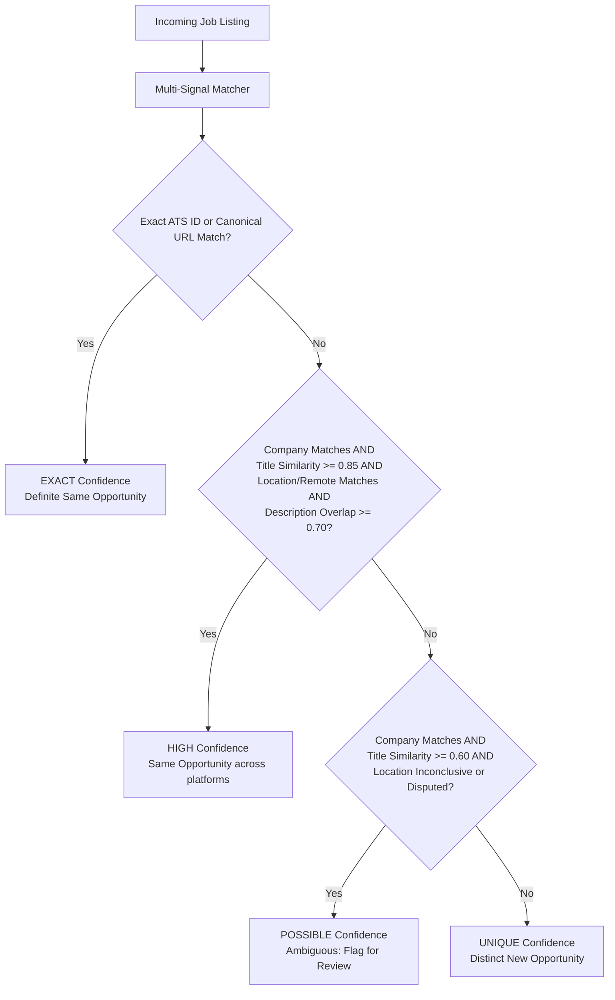

# Cross-Platform Job & Application Deduplication Architecture

**Document Version:** 1.0.0 (Design & Architecture Plan)  
**Status:** PROPOSED — Pending Approval (Do Not Implement Until Approved)  
**Core Directive:** *"Deduplicate listings aggressively, but deduplicate applications conservatively."*

---

## 1. Architectural Foundations & Core Principles

Cross-platform job automation across **LinkedIn**, **Naukri**, **Indeed**, **Glassdoor**, and **Foundit** faces a fundamental challenge: the same real-world job opening is posted simultaneously across multiple platforms, often with minor title formatting variations, distinct platform-assigned listing IDs, different referrer tracking parameters, or regional subsidiary entity names.

To solve this without false positives (erroneously skipping genuinely different roles at the same company) or false negatives (spamming recruiters with duplicate applications across platforms), this architecture establishes 8 non-negotiable principles:

1. **Separation of Listing Identity vs Opportunity Identity vs Application State:**
   - **Job Listing (`Job`):** A platform-specific advertisement (e.g. LinkedIn listing ID `3849102`, Naukri listing ID `041026001928`).
   - **Job Opportunity (`JobOpportunity`):** The underlying real-world hiring requisition at a company. Multiple listings across platforms point to one opportunity.
   - **Application (`Application`):** The user's submission action. Tied to an opportunity and the specific listing used to submit.
2. **Preservation of All Discovered Listings:**
   - Discovered platform listings are **never deleted or discarded**. If an opportunity is found on LinkedIn, Naukri, and Indeed, all three listings are retained in the database for tracking, analytics, and record-keeping.
3. **Conservative Application Deduplication:**
   - Listings may be grouped into opportunities with high confidence, but an application is **only suppressed automatically when the match is `EXACT` or `HIGH`**. Ambiguous matches are classified as `POSSIBLE` and escalated for user review or policy handling.
4. **Platform Job IDs are Intra-Platform Only:**
   - Platform listing IDs (`job_id`) are unique solely within their host platform. They are never used as cross-platform identifiers.
5. **No Automatic Suppression on Company + Title Alone:**
   - Companies frequently hire multiple different roles with identical or near-identical titles (e.g. *Software Engineer* in Payments vs *Software Engineer* in Cloud Infrastructure; or two openings for *Data Analyst* on separate teams). Company + title alone is never an automatic duplicate.
6. **Time is a Policy Signal, Not an Identity Signal:**
   - Recency (e.g., 60 days cooldown) is an *application policy constraint*, not proof of identity. Two listings posted on the same day can be distinct roles, and a listing posted 90 days later might be the exact same evergreen requisition.
7. **Safe Tracking Parameter Allowlist:**
   - External application URLs are the strongest cross-platform identity signal, but query parameters must **not** be stripped blindly. Only a safe, explicit allowlist of known tracking/marketing parameters (`utm_*`, `ref`, `gh_src`, etc.) may be stripped, preserving critical routing parameters like `?jobId=123` or `?id=xyz`.
8. **Deterministic Matching First:**
   - Deterministic multi-signal heuristics are the primary authority. LLMs are never used as the authoritative gatekeeper for deduplication.

---

## 2. Existing Schema Analysis

### Current Database Models (`app/db/models/`):

1. **`Job` (`jobs` table):**
   - **Role in practice:** Represents a single *platform listing*.
   - **Columns:** `id`, `platform`, `external_job_id`, `job_fingerprint` (UNIQUE), `title`, `company_raw`, `location`, `work_style`, `source_url`, `application_method`, `application_url`, `description`, `raw_metadata`, `first_seen_at`, `last_seen_at`, `is_active`.
   - **Current `generate_job_fingerprint`:**
     $$\text{Fingerprint} = \text{SHA256}(\text{platform} \parallel \text{external\_job\_id} \parallel \text{company} \parallel \text{title} \parallel \text{location} \parallel \text{source\_url})$$
   - **Limitation:** The fingerprint explicitly includes `platform`, `external_job_id`, and `source_url`. As a result, the exact same job on Naukri and LinkedIn produces two completely disjoint fingerprints with zero cross-platform relationship.

2. **`Application` (`applications` table):**
   - **Role in practice:** Represents an application attempt or submission.
   - **Columns:** `id`, `job_id` (FK to `jobs.id`), `user_id`, `resume_id`, `contact_id`, `status` (`SUBMITTED`, `APPLYING`, etc.), `applied_at`, `skip_reason`, `failure_reason`.
   - **Limitation:** Directly points to `job_id` (the single platform listing). It has no awareness of whether the candidate already applied to this same opening via a different listing on another platform.

3. **`ApplicationTracker` (`modules/tracker.py`):**
   - **In-memory cache key:** `(platform, job_id)`.
   - **Limitation:** Queries like `is_already_applied(job_id, platform="naukri")` only inspect records where `platform == "naukri"`. If the user applied via LinkedIn yesterday, Naukri reports `is_applied = False` and proceeds to re-apply.

---

## 3. Proposed Data Model & Schema Evolution

To satisfy the `JobOpportunity` concept without breaking existing queries, views, or platform drivers, we introduce `JobOpportunity` as the parent canonical entity, link `Job` listings to it via a foreign key, and establish an audit trail for deduplication evidence.

```
JobOpportunity (Canonical Hiring Requisition)
    ├── id: INT (PK)
    ├── canonical_company_id: INT (FK -> companies.id)
    ├── canonical_title: VARCHAR(255)
    ├── canonical_company_name: VARCHAR(255)
    ├── canonical_application_url: VARCHAR(1024) (Normalized ATS URL)
    ├── ats_provider: VARCHAR(50) (e.g. greenhouse, lever, workday)
    ├── ats_job_id: VARCHAR(100) (e.g. 5291039)
    ├── primary_location: VARCHAR(255)
    ├── status: VARCHAR(50) (DISCOVERED, QUALIFIED, APPLYING, APPLIED, SKIPPED, CLOSED)
    ├── first_discovered_at: DATETIME
    ├── last_activity_at: DATETIME
    │
    ├── Listings (1:N):
    │     ├── Job (platform='linkedin', external_job_id='101', listing_url='...')
    │     ├── Job (platform='naukri',   external_job_id='202', listing_url='...')
    │     ├── Job (platform='indeed',   external_job_id='303', listing_url='...')
    │     └── Job (platform='glassdoor', external_job_id='404', listing_url='...')
    │
    └── Applications (1:N):
          └── Application (opportunity_id=X, job_id=1, platform='linkedin', status='SUBMITTED')
```

### Proposed Schema Additions:

#### Table 1: `job_opportunities`
```sql
CREATE TABLE IF NOT EXISTS job_opportunities (
    id INTEGER PRIMARY KEY AUTOINCREMENT,
    canonical_company_id INTEGER REFERENCES companies(id) ON DELETE SET NULL,
    canonical_company_name VARCHAR(255) NOT NULL,
    canonical_title VARCHAR(255) NOT NULL,
    canonical_application_url VARCHAR(1024),
    ats_provider VARCHAR(50),
    ats_job_id VARCHAR(100),
    primary_location VARCHAR(255),
    work_style VARCHAR(50),
    status VARCHAR(50) NOT NULL DEFAULT 'DISCOVERED',
    applied_job_id INTEGER REFERENCES jobs(id) ON DELETE SET NULL,
    applied_at DATETIME,
    created_at DATETIME NOT NULL DEFAULT CURRENT_TIMESTAMP,
    updated_at DATETIME NOT NULL DEFAULT CURRENT_TIMESTAMP
);

CREATE INDEX IF NOT EXISTS ix_job_opp_company_title ON job_opportunities(canonical_company_name, canonical_title);
CREATE INDEX IF NOT EXISTS ix_job_opp_app_url ON job_opportunities(canonical_application_url);
CREATE INDEX IF NOT EXISTS ix_job_opp_ats ON job_opportunities(ats_provider, ats_job_id);
CREATE INDEX IF NOT EXISTS ix_job_opp_status ON job_opportunities(status);
```

#### Table 2: `job_deduplication_evidence` (Decision Audit Trail)
```sql
CREATE TABLE IF NOT EXISTS job_deduplication_evidence (
    id INTEGER PRIMARY KEY AUTOINCREMENT,
    incoming_job_id INTEGER NOT NULL REFERENCES jobs(id) ON DELETE CASCADE,
    matched_opportunity_id INTEGER REFERENCES job_opportunities(id) ON DELETE CASCADE,
    matched_job_id INTEGER REFERENCES jobs(id) ON DELETE SET NULL,
    confidence_level VARCHAR(20) NOT NULL, -- EXACT, HIGH, POSSIBLE, UNIQUE
    decision VARCHAR(50) NOT NULL,         -- LINKED_EXISTING, CREATED_NEW, NEEDS_REVIEW, BLOCKED_APPLICATION
    evidence_json TEXT NOT NULL,           -- Structured signal matches (URL, tokens, IDs)
    decision_reason VARCHAR(512) NOT NULL,
    evaluated_at DATETIME NOT NULL DEFAULT CURRENT_TIMESTAMP
);

CREATE INDEX IF NOT EXISTS ix_dedup_evidence_job ON job_deduplication_evidence(incoming_job_id);
CREATE INDEX IF NOT EXISTS ix_dedup_evidence_opp ON job_deduplication_evidence(matched_opportunity_id);
```

#### Columns Added to `jobs` (Backwards Compatible):
- `opportunity_id` (`INTEGER`, `ForeignKey("job_opportunities.id")`, indexed, nullable).
- `canonical_url_hash` (`VARCHAR(64)`, indexed, nullable): SHA-256 of normalized application URL.

#### Columns Added to `applications` (Backwards Compatible):
- `opportunity_id` (`INTEGER`, `ForeignKey("job_opportunities.id")`, indexed, nullable).

---

## 4. Multi-Signal Matching Algorithm & Confidence Levels

### 4.1 URL Normalization Engine (Safe Allowlist Strategy)

External application URLs must be canonicalized by stripping **only recognized marketing, attribution, and tracking query parameters**, while strictly preserving application/routing query parameters:

```python
# Safe allowlist of known tracking parameters to strip
TRACKING_QUERY_PARAMS = {
    # Standard analytics & UTM
    "utm_source", "utm_medium", "utm_campaign", "utm_term", "utm_content",
    "utm_id", "utm_reader", "utm_referrer", "utm_name",
    # Platform attribution
    "ref", "refid", "reference", "source", "src", "origin", "lever-origin",
    "gh_src", "gh_jid", "linkedin_origin", "naukri_src", "indeed_src",
    # Ad and click trackers
    "fbclid", "gclid", "dclid", "msclkid", "twclid", "yclid",
    # Session / display noise
    "mode", "iis", "iisn", "trk", "trkcampaign", "tracking",
}

# Parameters that must NEVER be stripped (critical routing / job identifiers)
PROTECTED_JOB_PARAMS = {
    "jobid", "job_id", "jid", "id", "requisitionid", "reqid", "req_id",
    "postingid", "positionid", "openingid", "p",
}
```

#### Extraction of ATS Identifiers:
- **Greenhouse:** `boards.greenhouse.io/{company}/jobs/{job_id}` $\rightarrow$ Provider: `greenhouse`, ATS ID: `{job_id}`.
- **Lever:** `jobs.lever.co/{company}/{job_uuid}` $\rightarrow$ Provider: `lever`, ATS ID: `{job_uuid}`.
- **Workday:** `{company}.wd{N}.myworkdayjobs.com/.../{job_id}` $\rightarrow$ Provider: `workday`, ATS ID: `{job_id}`.
- **Ashby:** `jobs.ashbyhq.com/{company}/{job_id}` $\rightarrow$ Provider: `ashby`, ATS ID: `{job_id}`.
- **SmartRecruiters:** `jobs.smartrecruiters.com/{company}/{job_id}` $\rightarrow$ Provider: `smartrecruiters`, ATS ID: `{job_id}`.

### 4.2 Semantic Entity Normalization (Preserving Domain Identity)

Normalization must **preserve** technical, regional, and organizational identity words:
- **Preserved Keywords:** `India`, `Remote`, `Hybrid`, `Backend`, `Frontend`, `AI`, `ML`, `Cloud`, `Payments`, `Security`, `DevOps`, `Infrastructure`, `Platform`.
- **Company Normalization:** Strips legal punctuation and pure corporate suffixes (`Inc.`, `LLC`, `Pvt. Ltd.`, `Corp.`) but **never** department or division names.
- **Title Normalization:** Normalizes seniority abbreviations (`Sr.` $\rightarrow$ `Senior`, `Jr.` $\rightarrow$ `Junior`, `Dev` $\rightarrow$ `Developer`) while preserving core functional discipline and stack.

### 4.3 Multi-Signal Matrix & Confidence Scoring

Matching evaluates 9 independent signals:

| Signal Name | Weight / Power | Description |
| :--- | :--- | :--- |
| **`S1: ATS_IDENTIFIER`** | Primary (Definitive) | Same ATS provider and exact ATS job requisition ID. |
| **`S2: CANONICAL_APP_URL`** | Primary (Definitive) | Normalized external application URLs match exactly. |
| **`S3: COMPANY_NORMALIZED`** | Baseline Requirement | Normalized company entity matches. |
| **`S4: TITLE_TOKEN_SIMILARITY`**| High (0.0 to 1.0) | Jaccard / Levenshtein similarity on normalized functional title tokens. |
| **`S5: LOCATION_COMPATIBILITY`**| Medium | Same city/region, or both marked as `Remote` / compatible work style. |
| **`S6: DEPARTMENT_MATCH`** | Medium | Same department/division where available in job metadata. |
| **`S7: EMPLOYMENT_TYPE`** | Medium | `Full-time`, `Contract`, `Internship` alignment. |
| **`S8: DESCRIPTION_SIMILARITY`**| Supporting | Cosine / token overlap on core job description requirements. |
| **`S9: SALARY_OVERLAP`** | Supporting | Salary brackets overlap within compatible bounds. |

### 4.4 Four Distinct Confidence Levels



1. **`EXACT`:**
   - Same ATS provider & ATS job ID (`S1`), OR identical normalized external application URL (`S2`).
   - *Action:* Automatically link to existing `JobOpportunity`. If opportunity already has a submitted application, mark listing as `SKIPPED (ALREADY_APPLIED_CROSS_PLATFORM)`.
2. **`HIGH`:**
   - Same normalized company (`S3`), high title token similarity ($\ge 0.85$, `S4`), compatible location/work style (`S5`), and consistent employment type.
   - *Action:* Automatically link to existing `JobOpportunity`. Governed by application policy.
3. **`POSSIBLE`:**
   - Same company (`S3`), moderate title similarity ($0.60 \le \text{sim} < 0.85$), but missing application URL, different department, or ambiguous location.
   - *Action:* Create link with `NEEDS_REVIEW` flag. **Never automatically suppress applications.** Surface to user in UI triage queue.
4. **`UNIQUE`:**
   - No company match, or distinct title/function/requisition.
   - *Action:* Create new `JobOpportunity` and proceed to qualification and application pipeline.

---

## 5. Application Policy Layer (Decoupled from Deduplication)

The deduplication engine only answers: *"Is this listing the same opportunity as that listing?"*  
The **Application Policy** answers: *"Given this opportunity's history, should we apply to this listing?"*

### Policy Rules Matrix:

| Opportunity State | Incoming Listing Status | Application Policy Action | Justification |
| :--- | :--- | :--- | :--- |
| **`APPLIED`** (via LinkedIn) | Discovered on Naukri | **SUPPRESS_APPLICATION** (Auto-Skip) | Application already submitted for this requisition. Prevents recruiter spam. |
| **`APPLYING`** (Worker active) | Discovered on Indeed | **LOCK_WAIT / SUPPRESS** | Prevents concurrent duplicate submissions. |
| **`FAILED`** (Technical error) | Discovered on Indeed | **ALLOW_RETRY_ALTERNATIVE_PLATFORM** | If LinkedIn Easy Apply failed technically, Naukri/Indeed direct apply may succeed. |
| **`SKIPPED`** (Disqualified) | Discovered on Glassdoor | **SUPPRESS_IF_HARD_FILTER** | If rejected by user's hard filters (e.g. salary too low), don't re-evaluate unless listing has new data. |
| **`MANUAL_REQUIRED`** | Discovered on Naukri | **PRESERVE_INTERVENTION** | Do not bypass human review gate. |

### Configurable User Application Policies:
1. `allow_reapply_after_days`: (Default: `None` / Never reapply to same opportunity). Optional integer (e.g. `180` days) for evergreen roles.
2. `review_possible_duplicates`: (Default: `True`). If confidence is `POSSIBLE`, do not skip silently; require human confirmation.
3. `preferred_platform_priority`: (Default: `["linkedin", "indeed", "naukri", "glassdoor", "foundit"]`). If multiple listings exist simultaneously, prefer applying via the user's top-ranked platform.

---

## 6. Concurrency & Database-Backed Uniqueness Strategy

When multiple platform workers (e.g. LinkedIn worker and Naukri worker) run concurrently, a race condition can occur:
1. Both workers discover the same Stripe requisition at the exact same second.
2. Both query `job_opportunities` and find no active application.
3. Both proceed to submit an application.

### Concurrency Defense:
1. **Database-Level Advisory Lock / Short Transaction Lock:**
   - In SQLite, transactional writes serialize through WAL mode.
   - Opportunity state transitions (`DISCOVERED` $\rightarrow$ `APPLYING`) must occur inside a short, atomic transaction before launching browser navigation.
2. **Atomic Compare-and-Swap on Opportunity:**
   ```sql
   UPDATE job_opportunities
   SET status = 'APPLYING', updated_at = CURRENT_TIMESTAMP
   WHERE id = :opp_id AND status NOT IN ('APPLYING', 'APPLIED');
   ```
   If the update affects `0` rows, another worker has already claimed the opportunity. The second worker immediately backs off and skips submission.
3. **Unique Database Constraint on Application Opportunity:**
   ```sql
   CREATE UNIQUE INDEX IF NOT EXISTS uq_applications_active_opp
   ON applications(opportunity_id)
   WHERE status IN ('SUBMITTED', 'APPLYING');
   ```
   Guarantees that even under concurrent thread races, the database rejects a second active application for the same opportunity.

---

## 7. Migration Requirements & Backwards Compatibility

1. **Idempotent Migration Script (`ensure_sqlite_schema` in `app/db/session.py`):**
   - Check if `job_opportunities` and `job_deduplication_evidence` tables exist; create if missing.
   - Safely add `opportunity_id` column to `jobs` and `applications`.
2. **Backfill / Seed Historical Data:**
   - Run a one-time migration grouping existing `jobs` into `job_opportunities`:
     - Group 1: Exact matching normalized `application_url`.
     - Group 2: Single-listing opportunities for standalone jobs.
   - Connect existing `applications` to their respective canonical `opportunity_id`.
3. **Zero Impact on Existing Platforms:**
   - LinkedIn, Naukri, Indeed, Glassdoor, and Foundit scrapers continue to instantiate `JobDiscoveredEvent` as normal.
   - The shared `JobDeduplicationService` wraps the discovery event inside `AutomationBridge` without touching Selenium drivers.

---

## 8. UI & Observability Implications

1. **Jobs View & Applications View:**
   - Display a **"Platform Listings"** badge on cards (e.g. `[LinkedIn, Naukri, Indeed]`) showing all platforms where this opportunity was detected.
   - Show canonical opportunity info alongside platform listing details.
2. **Evidence Drawer in Logs & Battlefield Tab:**
   - When a job is skipped due to cross-platform deduplication, show full expandable evidence:
     ```
     [DUPLICATE DETECTED: HIGH CONFIDENCE]
     • Matched Opportunity: #492 (Senior Python Developer @ Stripe)
     • Prior Application: SUBMITTED via LinkedIn on 2026-10-04 14:22:10
     • Evidence Signals:
         - Canonical Application URL: jobs.lever.co/stripe/5a2b1c (100% Match)
         - Title Similarity: 0.94 ("Sr. Python Dev" vs "Senior Python Developer")
         - Location: Remote (Compatible)
     • Action: Preserved listing #819; skipped application submission.
     ```
3. **Review Queue for `POSSIBLE` Duplicates:**
   - A dedicated filter chip in Jobs / Applications view: *"Possible Duplicates (Review Required)"* allowing the user to click:
     - `[Link to Opportunity]` $\rightarrow$ Marks as duplicate listing.
     - `[Confirm as Distinct Job]` $\rightarrow$ Clears link and allows normal application.

---

## 9. Comprehensive Test Plan (20 Mandatory Scenarios)

The test suite [`tests/test_job_deduplication_service.py`](file:///home/ahmad10raza/Documents/Mastering/Apply-and-Pray/tests/test_job_deduplication_service.py) will validate all 20 required edge cases:

1. **Same platform, same job ID:** Intra-platform listing update, not duplicate opportunity creation.
2. **Same external ATS URL across platforms:** Normalized URL match $\rightarrow$ `EXACT` confidence, links listings.
3. **Different tracking parameters:** URLs with `?utm_source=linkedin` vs `?ref=naukri` match identically after normalization.
4. **Preserved functional URL parameters:** URLs with `?jobId=1001` vs `?jobId=1002` correctly distinguish as different opportunities.
5. **Same company & title, different location:** Company X, "Software Engineer" (London) vs (Tokyo) $\rightarrow$ distinct opportunities.
6. **Same company, title & location, different description:** Separate team requisitions $\rightarrow$ `POSSIBLE` or `UNIQUE` (not suppressed).
7. **Same company with two identical titles (simultaneous postings):** Evaluates requisition IDs and description similarity before deciding.
8. **Reposted job (same platform, 30 days later):** Identified as same opportunity listing lifecycle update.
9. **Different ATS job IDs:** Same company, similar title, but `gh_jid=111` vs `gh_jid=222` $\rightarrow$ separate opportunities.
10. **Already applied on LinkedIn, discovered on Naukri:** Naukri listing saved; application suppressed with exact evidence reference.
11. **Already applied on Naukri, discovered on Glassdoor:** Glassdoor listing saved; application suppressed.
12. **Possible duplicate requiring review:** Ambiguous signals $\rightarrow$ `POSSIBLE` confidence, flagged for review without silent suppression.
13. **No external application URL:** Evaluates title token similarity, location, and description fallback without crashing.
14. **Missing company name:** Handled safely as `UNIQUE` or unlinked, prevents corrupted grouping.
15. **Missing location:** Handled gracefully; relies on description/title signals.
16. **Malformed URL structure:** URL validator safely handles invalid URI strings without failing discovery.
17. **Complex query parameters with encoded characters:** Handles RFC 3986 encoding (`%20`, `&amp;`) safely.
18. **Duplicate discovery during concurrent automation runs:** Two worker threads submitting simultaneous discovery events $\rightarrow$ exactly one canonical opportunity created, both listings linked.
19. **Concurrent application submission race:** Worker A (LinkedIn) and Worker B (Naukri) attempting to apply simultaneously $\rightarrow$ DB unique constraint / lock ensures exactly one succeeds.
20. **Preserved listing integrity:** Verifies that linking an opportunity does not mutate or overwrite platform-specific listing details.

---

## 10. Summary of Architectural Guarantees

| Invariant | Guarantee |
| :--- | :--- |
| **Listing Preservation** | 100% of discovered platform listings are retained in the database. |
| **Quota Protection** | Candidates never waste daily submission quotas on identical requisitions. |
| **Deterministic Transparency** | Every deduplication decision records machine-readable evidence (`evidence_json`). |
| **No Silent False Suppressions** | No job is suppressed solely because company and title strings match. |
| **Thread Safety** | Concurrency locks and DB constraints prevent dual simultaneous submissions. |
| **Zero Scraping Coupling** | Platform browser engines remain cleanly decoupled from deduplication logic. |

---

*This document serves as the formal design plan. Once approved by the user, implementation will proceed systematically through the database migration, normalization service, deduplication engine, and unit test suite.*
