# JobPilot Desktop — Complete Pages, Features & Functions Summary

> **Document Purpose:** Comprehensive catalog of every page, feature, and function across the entire JobPilot platform, serving as the blueprint for creating a **Unified Master Dashboard** that consolidates mission-critical controls, automation, pipeline telemetry, and candidate tools into a single command center.

---

## 🗺️ Master Navigation & Page Map

The application is structured into **6 Functional Zones** comprising **15 Distinct Pages**:

```mermaid
graph TD
    A[JobPilot Shell] --> B[Workspace]
    A --> C[Jobs & Search]
    A --> D[Pipeline & Outreach]
    A --> E[Intelligence & Analytics]
    A --> F[Candidate & Documents]
    A --> G[System & Diagnostics]

    B --> B1[1. Dashboard Overview]
    B --> B2[2. Live Automation Control]

    C --> C1[3. Jobs Repository]
    C --> C2[4. Job Search & Scraper]

    D --> D1[5. Applications Pipeline]
    D --> D2[6. Outreach & Inbox Hub]
    D --> D3[7. Interviews Tracker]
    D --> D4[8. Follow-ups & Reminders]

    E --> E1[9. Analytics & Conversion]
    E --> E2[10. QnA Vault & Knowledge]

    F --> F1[11. Candidate Profile]
    F --> F2[12. Resumes & ATS Audit]

    G --> G1[13. Platforms & Sessions]
    G --> G2[14. System Logs & Tracing]
    G --> G3[15. Settings & AI Config]
```



---

## Page-by-Page Feature & Function Breakdown

### 1. Dashboard Overview (`DashboardView`)
*Primary Role: Top-level operational overview & quick actions.*

* **Personalized Welcome Banner**:
  * Displays candidate greeting, profile readiness, and system automation state.
  * Direct action triggers: **Start Automation**, **Add Manual Job**, and **Quick Refresh**.
* **Core KPI Metric Cards (Row of 6)**:
  * **Jobs Discovered**: Total scraped and imported jobs in repository.
  * **Submitted Applications**: Total sent/submitted applications across all platforms.
  * **Under Review**: Applications actively awaiting recruiter or ATS responses.
  * **Interviews Scheduled**: Count of active upcoming interview rounds.
  * **Offers Received**: Successful pipeline completions.
  * **Conversion Rate**: Percentage calculation (`Submitted -> Interview` or `Discovered -> Submitted`).
* **Visual Recruitment Pipeline Funnel**:
  * Horizontal visual stage progression with proportional percentage drop-offs.
  * Stages: Applied → Screening → Interview → Offer → Rejected.
* **Upcoming Schedules Card**:
  * Chronological preview of next scheduled interviews, deadlines, and overdue follow-ups.
* **Platform Breakdown & Trigger Deck**:
  * Metric cards for LinkedIn, Naukri, Indeed, Glassdoor, and Foundit with live status dots.
  * One-click trigger buttons to launch individual platform bots directly from the dashboard.
* **Real-time Activity Stream**:
  * Live timeline feed showing timestamped events (e.g., "Applied to AI Engineer at Acme", "Scraped 15 jobs on Naukri").
  * Pause-on-scroll and auto-scroll-to-latest behavior.

---

### 2. Live Automation & Mission Control (`AutomationView`)
*Primary Role: Bot execution, browser supervision, telemetry, and safety controls.*

* **Hero Execution Status**:
  * Big status pill: `IDLE`, `RUNNING`, `PAUSED`, `STOPPED`, `ERROR`.
  * Current action telemetry: Factual step descriptions (e.g., "Navigating to easy-apply modal", "Filling salary field").
* **Execution Command Controls**:
  * **Start / Resume**: Launches runner threads.
  * **Pause**: Pauses execution safely between questions or page transitions.
  * **Stop / Kill Switch**: Immediate shutdown and browser session teardown.
* **Platform Health Strip**:
  * Live status indicator chips for all 5 platforms showing session freshness and runner status.
* **Universal Step Indicator**:
  * Progress timeline showing multi-step form navigation (Step 1: Contact Info → Step 2: Experience → Step 3: QnA → Step 4: Review & Submit).
* **Live Execution Console / Stream**:
  * Color-coded terminal stream of bot actions.
  * Auto-scroll lock toggle with jump-to-bottom badge.
* **Anti-Bot & Humanizer Telemetry**:
  * Real-time indicators of stealth delays, typing delays, mouse jitter, and CAPTCHA detection alerts.

---

### 3. Jobs Repository (`JobsView`)
*Primary Role: Comprehensive data grid of all discovered job opportunities.*

* **Category Tabs with Live Counters**:
  * **All Jobs** (Total DB count)
  * **Easy Apply** (1-Click apply method)
  * **Company Portal** (External ATS redirects)
  * **Junk** (Trash / discarded listings)
* **High-Performance Filter Toolbar**:
  * **Search Keyword**: Substring search across title, company, description in DB.
  * **Location Input**: Specific location search (e.g. Bangalore, Remote).
  * **Platform Dropdown**: LinkedIn, Naukri, Indeed, Glassdoor, Foundit.
  * **Status Dropdown**: Not Applied, Applied, Interview, Rejected, Junk.
  * **Method Dropdown**: Easy Apply vs Company Portal.
  * **Match Score Filter**: `≥ 80%`, `≥ 70%`, `≥ 60%`, `≥ 50%`, `≤ 40%`, `≤ 30%`, `≤ 20%`, `≤ 10%`, or `Not Evaluated`.
  * **Active Filter Chips**: Removable chips with "Clear all" button.
* **Backend "Calculate All" Match Engine Trigger**:
  * Runs qualification scoring for all matching jobs across the entire database via asynchronous background workers.
* **ATS Data Table**:
  * Custom **JobsHeaderView** with native Select-All checkbox (Checked, Unchecked, Tri-state partial).
  * Centered row checkboxes with exact pixel parity.
  * Columns: Checkbox, Job Title, Company, Platform, Location, Experience, Method, Match Score Badge, Status Badge, Discovered Date.
  * Sortable columns including one-click sort by **Match Score** ascending/descending.
  * Column Visibility Toggle menu & Comfortable/Compact density modes.
* **Bulk Action Bar**:
  * Floats when 1 or more jobs are checked.
  * Actions: **⚡ Qualify Selected**, **🗑 Move to Junk / ↩ Restore**, **↗ Open in Browser**, **📋 Copy URLs**.
* **Side Inspection Detail Drawer**:
  * Deep-dive panel showing full job description, salary range, experience, requirements, and full qualification score breakdown with matched/missing skills.
* **CSV Export**:
  * Backend-filtered export of up to 5,000 matching listings with clean tabular formatting.

---

### 4. Job Search & Scraper Config (`SearchView`)
*Primary Role: Defining targeted search criteria and scheduling scrapers.*

* **Search Parameters Card**:
  * Job title keywords (e.g., "Full Stack Developer", "Python AI Engineer").
  * Location targeting (City, Country, Remote/Hybrid toggles).
  * Experience level sliders (0–2 yrs, 3–5 yrs, 5+ yrs).
  * Salary expectations (Min/Max, Currency, Period).
* **Platform Selector**:
  * Multi-select checkboxes for which platforms to query.
* **Search Sticky Save Bar**:
  * Dirty state indicator detecting unsaved criteria.
  * "Save Search Query" and "Run Search Now" CTA buttons.
* **Scraper Execution Options**:
  * Headless mode vs Visible Chrome browser toggle.
  * Max listings limit per search run (e.g. 25, 50, 100).
  * Date posted filters (Past 24 hours, Past week, Any time).

---

### 5. Applications Pipeline (`ApplicationsView`)
*Primary Role: Tracking job applications through hiring stages.*

* **Dual Presentation Layout**:
  * **Interactive Kanban Board**: Column cards by stage (`Applied`, `Screening`, `Interviewing`, `Offered`, `Rejected`, `Archived`). Drag-and-drop or right-click to advance.
  * **Data Grid Table View**: Tabular overview with dates, recruiter info, and notes.
* **Application Stage Lifecycle**:
  * Stage change audit modal with timestamp, notes, and outcome recording.
* **Application Metrics Bar**:
  * Quick counts per stage with conversion drop-off percentages.
* **Contextual Actions**:
  * Direct jump to **Outreach** thread or composer for that company.
  * Direct jump to **Schedule Interview** dialog.
  * Add custom notes and recruiter contacts.

---

### 6. Outreach & Communication Hub (`OutreachWorkspace`)
*Primary Role: Recruiter conversations, email sync, and bulk outreach campaigns.*

* **3-Pane Workspace Layout**:
  * **Pane 1: Conversation Inbox**:
    * Thread list with recruiter avatar, company name, position, and single-line snippet.
    * Real-time search filter (0ms response).
    * Badges for inbound replies (📥), outbound messages (📤), unread status, and draft indicators.
  * **Pane 2: Conversation Thread View**:
    * Chronological chat bubbles showing full conversation history.
    * Inline quick reply composer with autosave and AI drafting suggestions.
  * **Pane 3: Recruiter & Job Context Drawer**:
    * Recruiter metadata (Name, Email, Phone, LinkedIn profile).
    * Linked Job details, match score, application status.
    * Quick reminder/follow-up due date widget.
* **Bulk Outreach Campaign Wizard (`BulkOutreachDialog`)**:
  * Multi-target recipient selection table with validation badges (`✓ Ready` vs `⛔ Blocked`).
  * Email template picker with preview.
  * Variable merge tags: `{candidate_name}`, `{company_name}`, `{job_title}`, `{recruiter_name}`.
  * Batch sending with safety rate limiting and pause/resume capability.
* **Email Platform Sync (`EmailPlatformDialog`)**:
  * Google OAuth2 / Microsoft Outlook / IMAP connection settings.
  * Checkpoint sync status with "Fetch New Emails" action.

---

### 7. Interviews Tracker (`InterviewsView`)
*Primary Role: Managing technical, HR, and managerial interview rounds.*

* **Chronological Schedule List & Calendar View**:
  * Grouped by Today, Upcoming, and Past.
* **Interview Round Details**:
  * Company, position, interviewer name & title, meeting URL (Zoom/Meet/Teams), date, time, and timezone.
* **Stage Tagging**:
  * HR Screening, Technical Assessment, System Design, Hiring Manager, Cultural Fit, Final Round.
* **Preparation & Notes Kit**:
  * Dedicated scratchpad for company research, questions to ask, and technical topics to review.
* **Outcome Logger**:
  * Record round result: `PASSED`, `FAILED`, `OFFER_EXTENDED`, `RESCHEDULED`.

---

### 8. Follow-ups & Reminders (`FollowupsView`)
*Primary Role: Preventing opportunities from going cold through smart nudges.*

* **Smart Queue Categorization**:
  * **Overdue**: Past due date with urgent indicator.
  * **Due Today**: Immediate action recommended.
  * **Upcoming**: Scheduled for future days.
* **Auto-Generated Follow-up Rules**:
  * Rule 1: 5 days post-application with no response → Suggest recruiter nudge email.
  * Rule 2: 24 hours post-interview → Suggest Thank You note.
  * Rule 3: 7 days post-interview with no update → Suggest status check-in.
* **1-Click Actions**:
  * "Compose Follow-up" pre-fills template into Outreach Composer.
  * "Mark Completed" / "Snooze (2 days / 5 days)".

---

### 9. Analytics & Conversion Intelligence (`AnalyticsView`)
*Primary Role: Data-driven hiring analytics and funnel optimization.*

* **Full-Funnel Conversion Visualizer**:
  * Conversion rates across stages (`Discovered → Applied → Response → Interview → Offer`).
* **Platform Comparison Matrix**:
  * Bar charts comparing LinkedIn vs Naukri vs Indeed:
    * Highest response rate.
    * Highest interview rate.
    * Total application volume.
* **Time Metrics**:
  * Average time-to-first-response (days).
  * Average interview process duration.
* **Weekly Application Heatmap**:
  * Application volume by day of week and time of day.

---

### 10. QnA Knowledge Vault (`QnAView`)
*Primary Role: Ground-truth question and answer repository for 100% truthful form filling.*

* **Canonical QnA Catalog**:
  * Categorized entries: Work Authorization, Notice Period, Current/Expected CTC, Relocation, Total Experience.
* **Multi-Tier Resolution Pipeline**:
  * **Tier 1 (Deterministic)**: Regex and exact keyword matching against stored answers.
  * **Tier 2 (Profile Fact Bank)**: Verified profile facts derived from resume.
  * **Tier 3 (AI Fallback)**: Structured LLM prompt grounded strictly in candidate facts.
* **Unanswered Questions Triage**:
  * Highlights questions encountered by automation that could not be resolved with 100% confidence.
  * Candidate enters answer once; automatically stored and never asked again.
* **Import / Export**:
  * Import/Export catalog as JSON.

---

### 11. Candidate Profile (`ProfileView`)
*Primary Role: Single source of truth for candidate data.*

* **Personal & Contact Card**:
  * Full Name, Email, Phone, Current Location, Preferred Locations, Notice Period.
  * Links: LinkedIn, GitHub, Portfolio URL, Twitter.
* **Structured Fact Bank (`ProfileFact`)**:
  * Key-value repository of verified facts for zero-hallucination auto-filling.
* **Work Experience Timeline**:
  * Company, Title, Start/End Dates, Current Job toggle, Key Achievements, Tech Stack used.
* **Skills Matrix**:
  * Categorized into Primary Skills, Secondary Skills, Tools & Frameworks.
* **Education & Certifications**:
  * Degree, Institution, Graduation Year, Grade/CGPA, Certifications.

---

### 12. Resumes & ATS Document Hub (`ResumesView`)
*Primary Role: Managing tailored resume variants and ATS parsing score.*

* **Multi-Resume Library**:
  * Upload, rename, tag, and set default resume (e.g. "Fullstack_2026.pdf", "AI_ML_Engineer.pdf").
* **Embedded PDF Viewer**:
  * In-app document viewer with zoom and page controls.
* **SHA-256 Checksum Verification**:
  * Detects file tampering or accidental overwrite.
* **ATS Keyword Matcher**:
  * Analyzes resume text against sample job descriptions to highlight keyword density and gaps.

---

### 13. Platforms & Session Management (`PlatformsView`)
*Primary Role: Browser sessions, credentials, and cookies hygiene.*

* **5 Supported Platforms**:
  * LinkedIn, Naukri, Indeed, Glassdoor, Foundit.
* **Session & Cookie Status**:
  * Health badge (`ACTIVE`, `EXPIRING_SOON`, `LOGGED_OUT`, `BLOCKED`).
  * Cookie expiration countdown timer.
* **In-App Login Launcher**:
  * Spawns an isolated Chrome session allowing candidate to complete manual login / 2FA.
  * Automatically captures cookies upon successful authentication.
* **Daily Quota & Velocity Guards**:
  * Tracks number of applications sent today per platform against safe limits (e.g. 35/50).

---

### 14. System Logs & Diagnostics (`LogsView`)
*Primary Role: Engineering diagnostics, debugging, and audit trails.*

* **Log Stream Viewer**:
  * Live log terminal with syntax highlighting.
* **Filtering & Search**:
  * Log levels: `ALL`, `DEBUG`, `INFO`, `WARNING`, `ERROR`, `CRITICAL`.
  * Module filter: `applier`, `qna_engine`, `scraper`, `universal_agent`, `auth`.
* **Export & Diagnostics**:
  * Copy selected log lines.
  * Export complete log bundle for troubleshooting.

---

### 15. Settings & AI Configuration (`SettingsView`)
*Primary Role: Global application preferences and provider secrets.*

* **AI Model & Provider Config**:
  * Select Provider: OpenAI (GPT-4o), Google Gemini (Gemini 2.5/Flash), DeepSeek (V3/R1), or Local Ollama.
  * Secure API key storage and connection testing button.
* **Automation Safety Controls**:
  * Headless default toggle.
  * Speed / Delay multipliers (Stealth mode vs Fast mode).
  * Auto-solve CAPTCHA configuration.
* **Appearance & Theme**:
  * Dark Canvas (#0F1117 with Safety Orange accents) vs Light Canvas (#F6F8FA).
* **Database & Maintenance**:
  * Compact database, backup SQLite file, reset cache, and export master analytics CSV.

---

## 🏗️ Blueprint for the "All-in-One Unified Dashboard"

To build a **Unified Dashboard** that consolidates all pages into one commanding interface, we structure it into **4 Core Operational Quadrants**:

```
┌────────────────────────────────────────────────────────────────────────────────────────┐
│ 1. HEADER / MISSION STATUS STRIP                                                       │
│ [Active Candidate] • [Daily Quotas: 24/50 Apps] • [Platforms: 5/5 Healthy] • [Bot: IDLE] │
├─────────────────────────────────────────┬──────────────────────────────────────────────┤
│ 2. PIPELINE & TELEMETRY HUB (Left 60%)   │ 3. ACTIVE ACTION DECK (Right 40%)            │
│ ┌─────────────────────────────────────┐ │ ┌──────────────────────────────────────────┐ │
│ │ A. KPI Metric Cards (6 core metrics)│ │ │ E. Quick Bot Runner (1-Click Platform)   │ │
│ ├─────────────────────────────────────┤ │ ├──────────────────────────────────────────┤ │
│ │ B. Visual Recruitment Funnel        │ │ │ F. Urgent Follow-ups & Reminders (Top 3) │ │
│ ├─────────────────────────────────────┤ │ ├──────────────────────────────────────────┤ │
│ │ C. High-Match Jobs Queue (>=70%)    │ │ │ G. Next Scheduled Interview              │ │
│ ├─────────────────────────────────────┤ │ ├──────────────────────────────────────────┤ │
│ │ D. Recent Inbound Recruiter Messages│ │ │ H. Profile & QnA Confidence Score (94%)  │ │
│ └─────────────────────────────────────┘ │ └──────────────────────────────────────────┘ │
├─────────────────────────────────────────┴──────────────────────────────────────────────┤
│ 4. LIVE ACTIVITY & LOG STREAM (Collapsible Bottom Drawer)                              │
│ [19:45:12] Auto-applied to AI Engineer at Anthropic (Score: 88%) • [19:42:01] 12 scraped│
└────────────────────────────────────────────────────────────────────────────────────────┘
```

### Key Elements of the Unified Dashboard

1. **Top Command Strip**:
   * Candidate selector & resume status.
   * Real-time platform health pills (LinkedIn, Naukri, Indeed, Glassdoor, Foundit).
   * Daily Velocity Bar (e.g. `24 / 50 applications sent today`).
   * Master Automation CTA: `Start Intelligent Auto-Apply` with pause/kill buttons.

2. **Quadrant A: Core Pipeline & Metrics**:
   * Aggregated 6 KPI cards (Discovered, Submitted, Under Review, Interviews, Offers, Conversion %).
   * Stage conversion drop-off mini-funnel.

3. **Quadrant B: High-Priority Action Queues**:
   * **Top Match Opportunities**: Mini-table showing the top 5 unapplied jobs with `Match Score ≥ 70%` and 1-click "Apply Now".
   * **Recruiter Inbound Inbox**: Top 3 most recent recruiter messages with 1-click "Open Thread" or "AI Reply".
   * **Overdue Follow-ups**: Nudge actions due today with 1-click send.

4. **Quadrant C: Mission Control & Schedules**:
   * Next Upcoming Interview with meeting link and preparation notes button.
   * Platform Bot Runner Deck: Run individual scrapers or appliers directly with sliders.
   * QnA Readiness Gauge: % of verified facts available (highlights missing answers).

5. **Quadrant D: Unified Live Event Stream**:
   * Bottom stream showing real-time system events, application submissions, and scraper progress.
