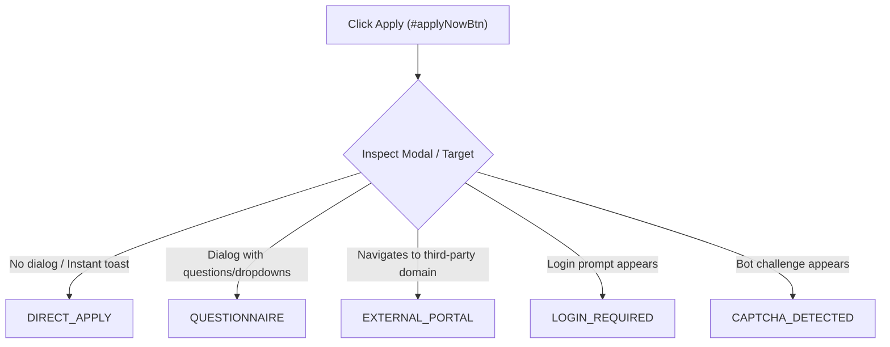

# Foundit (foundit.in) DOM Analysis & Technical Specification

> **Platform:** Foundit India (formerly Monster India)  
> **Base URL:** `https://www.foundit.in/`  
> **Target Version:** 2026 Modern Next.js / React Web Client  
> **Status:** Live Reconnaissance Completed (Phase 2 Discovery)  
> **Authoritative Specification:** For implementation of `platforms/foundit/`

---

## 1. Executive Summary & Architecture Overview

Foundit operates a modern dynamic single-page web architecture (React/Next.js). Search results follow a **Split-Pane Layout**:
- **Left Column:** Scrollable list of job cards (`div.cardContainer`), with batch sizes of ~15 cards per page/view.
- **Right Column:** Dynamic Job Details pane displaying the full job description, company details, and primary action buttons (`button#applyNowBtn`).
- **Interactive State:** Clicking a job card attaches the `.activeCard` CSS class and dynamically hydrates the right pane without a full page reload.

```
+-----------------------------------------------------------------------------------+
| Top Navigation: Search Bar [Skills] [Location] [Experience] [Search] | Login | Register |
+----------------------------------------------------+------------------------------+
| SRP Job Card List (Left Pane)                      | Job Details (Right Pane)     |
|                                                    |                              |
| +------------------------------------------------+ | Company Logo & Info          |
| | [id="68631630"] .cardContainer.activeCard      | | Job Title                    |
| |   .jobTitle: "Mulesoft RPA Developer"          | | Company Name                 |
| |   .companyName: "plumlogix"                    | | Exp, Location, Age           |
| |   .experienceSalary: "4 - 6 Years"             | |                              |
| |   .location: "Pune, India"                     | | [ Apply Now (#applyNowBtn) ] |
| |   .timeText: "Posted a day ago"                | |                              |
| +------------------------------------------------+ | Job Description (Full Body)  |
|                                                    | - Roles & Responsibilities   |
| +------------------------------------------------+ | - Requirements & Skills      |
| | [id="68486531"] .cardContainer                 | |                              |
| |   .jobTitle: "RPA Developer - UiPath"          | |                              |
| +------------------------------------------------+ |                              |
+----------------------------------------------------+------------------------------+
```

---

## 2. Authentication & Session State Specification

Foundit provides a unified authentication modal accessible across all portal pages via the top header navigation.

### 2.1 Login Modal Trigger
- **Header Login Button Selector:**
  ```css
  header button:has-text("Login"), 
  button.inline-flex:has-text("Login"),
  //button[contains(normalize-space(), 'Login')]
  ```
- **Direct Login URL:** `https://www.foundit.in/auth/login`

### 2.2 Auth Mode Transition (OTP to Password)
By default, Foundit presents an OTP-first prompt. For automated candidate authentication with email and password, the driver must switch to Password mode.

1. **Step 1 — Username Input:**
   - **CSS Selector:** `input#userName`
   - **Attributes:** `name="userName"`, `id="userName"`, `placeholder="Enter Email ID / Phone Number"`
   - **Action:** Clear and type candidate email (`candidate@example.com`).

2. **Step 2 — Switch to Password Mode:**
   - **XPath Selector:** `//*[contains(text(), 'Login via Password')]`
   - **CSS Selector:** `span.text-brand-primary.cursor-pointer`
   - **Action:** Click element to transition modal from OTP view to Password view.

3. **Step 3 — Password Input:**
   - **CSS Selector:** `input#password`
   - **Attributes:** `id="password"`, `name="password"`, `type="password"`, `placeholder="Enter your password"`
   - **Action:** Clear and type candidate password (`@786&md#AS`).

4. **Step 4 — Submit Login:**
   - **CSS Selector:** `button#loginSubmit[type='submit']`
   - **Attributes:** `id="loginSubmit"`, `type="submit"`, `aria-label="submit"`
   - **Text:** `Login`
   - **Action:** Click element (with JS fallback `driver.execute_script("arguments[0].click();", btn)`).

### 2.3 Session State Detection Matrix
The driver inspects the DOM to determine authentication status:

| State | Condition / DOM Signal | Action Required |
|---|---|---|
| **`LOGGED_IN`** | Presence of user profile menu (`div[class*='userProfile']`, `div[class*='user-avatar']`, or account icon); absence of header `Login` / `Register` buttons; current URL contains `/seeker/` or `/dashboard`. | Continue with search/apply workflow. |
| **`LOGIN_REQUIRED`** | Visible header `Login` / `Register` buttons; or login modal actively displayed; URL contains `/auth/login`. | Execute `login()` procedure. |
| **`CAPTCHA`** | Cloudflare Turnstile (`iframe[src*='challenges.cloudflare.com']`), Arkose Labs challenge, or bot detection interstitial. | Trigger `InterventionType.CAPTCHA_DETECTED`, notify UI, wait for user resolution. |
| **`OTP_REQUIRED`** | Presence of 6-digit OTP input boxes or "Enter OTP sent to your email/phone". | Trigger `InterventionType.MANUAL_ACTION_REQUIRED`, pause and wait for user. |
| **`LOGIN_ERROR`** | Alert with "Invalid credentials", "User does not exist", or red validation border. | Raise `FounditLoginError` and abort platform run safely. |

---

## 3. Search Engine & URL Parameter Specification

### 3.1 Search URL Syntax
Foundit supports canonical, pre-encoded search URLs:
```
https://www.foundit.in/srp/results?query={query}&locations={location}&experienceRanges={min_exp}~{max_exp}&start={offset}
```

### 3.2 Query Parameter Definitions

| Parameter | Type | Example | Description |
|---|---|---|---|
| `query` | `string` | `RPA+Developer` | Search keywords, roles, skills (URL-encoded or `+` separated). |
| `locations` | `string` | `India` or `Delhi` | Target country or city filter. |
| `experienceRanges` | `string` | `2~5` | Min and max experience in years separated by `~`. |
| `start` | `integer` | `0`, `15`, `30` | Result offset for pagination (0 = page 1, 15 = page 2, 30 = page 3). |
| `sort` | `integer` | `1` | Sort order (1 = Relevance, 2 = Freshness/Date). |
| `jobAge` / `freshness` | `integer` | `7`, `30` | Optional days filter (Past week = 7, Past month = 30). |

### 3.3 Pagination Mechanics
- **Card Batch Size:** 15 cards per request.
- **Offset Formula:** `start = (page - 1) * 15`.
- **DOM Pagination Element:** `div.pagination` containing page number buttons (`1`, `2`, `3`, `4`, `5`).
- **Next Page Selector:** `div.pagination button:has-text("Next")`, `div.pagination a:has-text("Next")`, or numeric page button click.

---

## 4. Job Card DOM Structure & Field Extraction

Foundit wraps each job posting in a structured card container on the SRP.

### 4.1 Card Container
- **Selector:** `div.cardContainer` or `div[class*='cardContainer']`
- **Native Job ID:** Stored directly in the card's `id` attribute:
  ```html
  <div id="68631630" class="cardContainer activeCard">
  ```
  *Native ID extraction:* `card.get_attribute("id")` $\rightarrow$ `"68631630"`.

### 4.2 Card Field Extraction Mapping

| Canonical `Job` Field | Foundit DOM Selector | Extraction Method & Transformation |
|---|---|---|
| `job_id` | `div.cardContainer` | `element.get_attribute("id").strip()` |
| `title` | `div#jobCardTitle.jobTitle`, `div.jobTitle` | `element.text.strip()` |
| `company` | `div.companyName p`, `div.companyName` | `element.text.strip()` |
| `location` | `div.bodyRow div.details.location` | `element.text.strip()` (e.g. `"Pune, India"`) |
| `experience_text` | `div.experienceSalary span.details` | `element.text.strip()` (e.g. `"4 - 6 Years"`) |
| `experience_min` | Extracted from `experience_text` | Regex parse lower bound $\rightarrow$ `4` |
| `experience_max` | Extracted from `experience_text` | Regex parse upper bound $\rightarrow$ `6` |
| `salary_text` | `div.experienceSalary .salary`, `.salaryText` | Preserved raw text if present (e.g. `"5-8 Lacs PA"`) |
| `salary_min` / `max` | Extracted from `salary_text` | Converted to annual INR figures |
| `posted_date` | `div.jobAddedTime p.timeText` | `element.text.strip()` (e.g. `"Posted a day ago"`) |
| `source_url` | Constructed canonical URL | `f"https://www.foundit.in/job/{job_id}"` |
| `badges` | `div.jobTags div.cardApplyLabel` | Captures `"Early Applicant"`, `"Urgent Hiring"` |

---

## 5. Job Description (JD) Extraction Pipeline

Foundit displays the job description in the right-hand details container when a card is selected, or on the dedicated job page (`https://www.foundit.in/job/{job_id}`).

### 5.1 Extraction Hierarchy
The driver uses a 5-tier fallback cascade:

```
[Level 1: Primary Container]
   div.jobDescription, div[class*='jobDescription']
         | (if empty or < 100 chars)
[Level 2: Details Pane Container]
   div.detailsContainer, div[class*='detailsContainer']
         | (if empty or < 100 chars)
[Level 3: Structured Metadata JSON-LD]
   script[type='application/ld+json'] (schema.org/JobPosting -> "description")
         | (if missing)
[Level 4: Semantic Content Block]
   article, section[class*='description']
         | (if missing)
[Level 5: Card Summary Fallback]
   Card text snippet and skills list
```

### 5.2 JD Validation Contract (`is_valid_job_description`)
Any extracted text must pass validation before being passed to `QualificationEngine` or `QnAEngine`:
- **Minimum length:** $\ge 80$ characters.
- **Content rejection:** Rejects text containing only "Loading...", "Please login to view details", "Error 404", or cookie consent banners.

---

## 6. Application Flow Taxonomy & Detection

Foundit exposes three primary application workflows upon clicking the apply trigger.

### 6.1 Apply Button Identification
- **Primary Selector:** `button#applyNowBtn` (located inside `div.applyBtnCont`).
- **Button Text:** `"Apply Now"` or `"Quick Apply"`.

### 6.2 Application Modal Flow States



1. **`DIRECT_APPLY` (1-Click / Easy Apply):**
   - Click triggers an instant application request using the candidate's existing Foundit profile resume.
   - Verified by post-click confirmation banner: `"Application Sent"`, `"Successfully Applied"`, or button changing to `"Applied"`.
2. **`QUESTIONNAIRE` (Multi-Step Screening Form):**
   - A modal dialog appears containing employer screening questions (notice period, current CTC, relevant skills, yes/no questions, file attachment).
   - Routed to `FounditFormHandler` to resolve fields with `QnAEngine`.
3. **`EXTERNAL` (Third-Party ATS):**
   - Button or link opens an external domain (e.g. `workday.com`, `taleo.net`, `greenhouse.io`, or company career portal).
   - Driver records state as `EXTERNAL`, logs the destination URL, and does **not** falsely mark as submitted.

---

## 7. Submission Verification & Idempotency Rules

### 7.1 Submission Confirmation Verification
Under no circumstances is clicking an Apply button alone treated as proof of application.
The submitter must poll for confirmation signals:
- **Confirmation Text Patterns:**
  - `"applied successfully"`
  - `"application submitted"`
  - `"application sent"`
  - `"thank you for applying"`
- **Button Transition:** Button text changes from `"Apply Now"` to `"Applied"` (or class `disabled`).

### 7.2 Safety Invariant
If a submission click occurs but confirmation is not received within the 15-second timeout window:
- State is recorded as **`UNKNOWN`**.
- **Critical Policy:** `UNKNOWN` states are **NEVER** automatically retried, protecting candidate accounts from duplicate submissions or account flagging.

---

## 8. Anti-Bot Protections & Driver Configuration

1. **Undetected ChromeDriver:** Initialized with `--disable-blink-features=AutomationControlled` and clean window size.
2. **Page Load Strategy:** Must be configured with `options.page_load_strategy = 'eager'`. Foundit loads external tracking beacons that stall the standard Selenium `normal` page load event.
3. **Stale Lock Cleanup:** Automated purge of `SingletonLock`, `SingletonCookie`, and `SingletonSocket` files in `~/.jobpilot-foundit-profile` prior to launch.
4. **Human Verification Policy:** Automated challenge bypassing is strictly forbidden. When a challenge occurs, the platform emits `AutomationInterventionEvent(InterventionType.CAPTCHA_DETECTED)` and halts cooperatively for user action.
