# LinkedIn Easy Apply Automation — End-to-End Workflow Architecture

> **Repository:** `JobPilot`  
> **Platform Target:** LinkedIn Jobs ("Easy Apply")  
> **Core Engine:** Python, Selenium WebDriver, Undetected-ChromeDriver, Unified QnA Engine & Local/Cloud LLM

---

## 1. High-Level Architecture Flowchart

```mermaid
flowchart TD
    Start([Launch python runAiBot.py]) --> Config[Load Unified Configuration\nconfig/profile.json & config/*.py]
    Config --> BrowserInit[Initialize Undetected-Chrome\nEager Load Strategy + Custom Flags + Profile Dir]
    BrowserInit --> AuthCheck{LinkedIn Logged In?}
    
    AuthCheck -- No --> DoLogin[Automated or Manual Login\nlogin_LN]
    DoLogin --> AuthCheck
    AuthCheck -- Yes --> AIInit[Initialize AI Provider\nOllama Llama 3.1 / OpenAI / Gemini / DeepSeek]
    
    AIInit --> SearchLoop[Search Term Loop\nIterate through search_terms]
    SearchLoop --> BuildURL[Build Direct Search URL\nKeywords + Location + Easy Apply + Date Posted]
    BuildURL --> NavURL[Navigate safely via safe_driver_get\nBypasses Fragile Modal Clicking]
    
    NavURL --> PageLoop[Pagination Loop\nPage 1, 2, 3... until switch_number reached]
    PageLoop --> ScrapeJobs[Collect occludable Job Listings\nfrom current page]
    
    ScrapeJobs --> JobCardLoop[Iterate each Job Card]
    JobCardLoop --> Deduplicate{Already Applied in CSV?}
    Deduplicate -- Yes --> SkipJob[Skip Job]
    Deduplicate -- No --> BlacklistCheck{Blacklisted Company\nor Bad Words in About?}
    
    BlacklistCheck -- Yes --> LogSkip[Log to failed_jobs.csv as Skipped]
    BlacklistCheck -- No --> JDAnalysis[Extract Job Description\nTitle, HR Info, Experience & Bad Words]
    
    JDAnalysis --> ExpCheck{Experience Required\n<= Candidate Experience?}
    ExpCheck -- No --> LogExpSkip[Skip: Experience mismatch]
    ExpCheck -- Yes --> BadWordsCheck{Contains Bad Words?\nUS Citizen, Clearance, etc.}
    BadWordsCheck -- Yes --> LogBW[Skip: Bad word matched]
    BadWordsCheck -- No --> EasyApplyTrigger{Is Easy Apply\nButton Available?}
    
    EasyApplyTrigger -- No --> ExtApply[Collect External Link if configured]
    EasyApplyTrigger -- Yes --> OpenModal[Open Easy Apply Modal]
    
    OpenModal --> FormLoop[Form Step Loop\nWhile Next / Review button exists]
    FormLoop --> AnswerEngine[Unified QnA Engine\nSelects, Radios, Text Inputs & AI Fallback]
    AnswerEngine --> ResumeHandler[Upload or Select Default Resume]
    ResumeHandler --> StepNext{Is Review Button Reached?}
    StepNext -- No --> ClickNext[Click Next & Continue Loop]
    ClickNext --> FormLoop
    
    StepNext -- Yes --> ReviewScreen[Reach Final Review Screen]
    ReviewScreen --> UncheckFollow[Uncheck 'Follow Company' Checkbox]
    UncheckFollow --> PauseCheck{pause_before_submit == true?}
    PauseCheck -- Yes --> ConfirmPopup[Show GUI Confirmation Modal\nWait for User Decision]
    ConfirmPopup --> SubmitJob
    PauseCheck -- No --> SubmitJob[Click 'Submit Application']
    
    SubmitJob --> LogSuccess[Record in all_applied_jobs.csv\nIncrement applied count]
    LogSuccess --> CountCheck{current_count >= switch_number?}
    CountCheck -- No --> MoreJobsOnPage{More jobs on this page?}
    MoreJobsOnPage -- Yes --> JobCardLoop
    MoreJobsOnPage -- No --> NextPageCheck{Next Page Available?}
    NextPageCheck -- Yes --> GoNextPage[Click Page N+1 Button]
    GoNextPage --> PageLoop
    NextPageCheck -- No --> SwitchTerm[Switch to Next Search Keyword]
    
    CountCheck -- Yes --> SwitchTerm
    SwitchTerm --> MoreTerms{More Search Terms?}
    MoreTerms -- Yes --> SearchLoop
    MoreTerms -- No --> Finish([Run Complete: Log Summary & Close])
```



---

## 2. End-to-End Workflow Breakdown (Step-by-Step)

### Step 1: System Initialization & Configuration Loading
1. **Unified Configuration (`config/profile.json`):**
   - The runner initializes `modules/config_loader.py`.
   - Reads candidate personal data (Mohd Ahmad Raza Ansari, contact, email, links).
   - Reads compensation preferences (Current CTC ₹3.5L, Expected CTC ₹5.5L, 30 days notice).
   - Reads platform search settings (Keyword search terms, `"search_location": "India"`, `"easy_apply_only": true`, `"date_posted": "Past week"`, `"switch_number": 30`, `"current_experience": 5`).
2. **Backward-Compatible Module Bridge:**
   - Populates global variables across `config/personals.py`, `config/search.py`, `config/questions.py`, and `config/settings.py`.
3. **Data Directories & Validation:**
   - Verifies directories exist (`logs/`, `output/`, `resumes/`).
   - Validates candidate resume file path (`Mohd_Ahmad_Raza_Ansari_Resume.pdf`).

---

### Step 2: Anti-Bot Stealth Browser Engine
1. **Undetected ChromeDriver (`modules/open_chrome.py`):**
   - Automatically detects the host's installed Google Chrome version (e.g., `Chrome 153`).
   - Bypasses Cloudflare / Akamai / LinkedIn bot detection via `undetected_chromedriver` kernel binary patch.
2. **Browser Profile & Storage:**
   - Stores session state in a dedicated persistent profile (`~/.jobpilot-chrome-profile`, with fallback to `~/.apply-and-pray-chrome-profile`).
   - Prevents having to re-authenticate or solve SMS/Email 2FA captchas on every session.
3. **W3C Performance Optimizations:**
   - **`options.page_load_strategy = 'eager'`**: ChromeDriver returns execution control as soon as the DOM tree (`DOMContentLoaded`) is ready (1–3 seconds), ignoring endless LinkedIn tracking websockets and analytics telemetry.
   - **Stability Flags**: Uses `--disable-gpu`, `--no-sandbox`, and `--disable-dev-shm-usage` for rock-solid memory management on Linux.
   - **Watchdog Recovery (`safe_driver_get`)**: If LinkedIn's network stream hangs past 30 seconds, it calls `window.stop()` and continues with the rendered page rather than crashing with a read timeout.

---

### Step 3: Session Authentication Verification
1. Evaluates `driver.current_url`:
   - If already on `https://www.linkedin.com/feed/`, the session is marked active.
2. If signed out:
   - Navigates to `https://www.linkedin.com/login`.
   - Populates credentials from `config/secrets.py` (or prompts manual one-time login).
   - Stores window handle as `linkedIn_tab`.

---

### Step 4: AI Engine Connection
1. Evaluates `ai_provider` in `config/secrets.py`:
   - **Ollama (Local LLM):** Connects to `http://localhost:11434/v1/` using model `llama3.1:8b` or `glm-4.7`.
   - **OpenAI / Gemini / DeepSeek:** Initializes corresponding API client if configured.
2. Injects the initialized client into `QnAEngine` for zero-shot question answering when hardcoded rules do not match.

---

### Step 5: Direct URL Filter Pre-Encoding (Zero-Click Navigation)
Instead of opening fragile UI modals on LinkedIn and clicking buttons that break when LinkedIn changes its front-end code, the bot builds a direct, native search query:

```python
search_url = build_search_url(searchTerm)
# Example Generated URL:
# https://www.linkedin.com/jobs/search/?keywords=RPA+Developer&location=India&f_AL=true&f_TPR=r604800
```

* **`keywords`**: Target role (e.g. `"RPA Developer"`).
* **`location`**: `"India"`.
* **`f_AL=true`**: Restricts results exclusively to **Easy Apply**.
* **`f_TPR=r604800`**: Restricts results to jobs posted within the **Past week**.
* **`sortBy=DD`**: (Optional) Sorts by most recent.
* **`f_WT`**: (Optional) Filters Remote / Hybrid / On-site.

`apply_filters()` verifies that standard filters are satisfied via the URL and skips opening the filter modal entirely, eliminating `element not interactable` errors.

---

### Step 6: Job Discovery, Deduplication & Qualification Screening

1. **Card Parsing:**
   - Finds all job cards on the page: `//li[@data-occludable-job-id]`.
2. **Deduplication Check:**
   - Reads `all_applied_jobs.csv`. If the `job_id` exists in the history file, it prints `Already applied` and skips immediately.
3. **Company Blacklist:**
   - Inspects the company name against `about_company_bad_words` (e.g., `Crossover`). If matched, skips and logs reason.
4. **Job Description Inspection:**
   - Clicks the job card to load the detail panel (`jobs-search__job-details`).
   - Extracts job title, company, work location, workplace style (Remote/Hybrid/On-site), and full description.
5. **Intelligent Experience Extraction (`extract_years_of_experience`):**
   - Scans the text for patterns like `1–5 Years`, `3 to 5 years`, `5+ years`, `min 2 yrs`.
   - **Minimum-Bound Strategy**: For ranges (`1–5 Years` or `3 to 5 years`), it extracts the **minimum** required experience (`1` or `3`) instead of the maximum.
   - Compares required experience against `current_experience` (`5` in candidate profile). If `required > current`, it skips the job.
6. **Description Bad Words Filter:**
   - Checks against `bad_words`: `"US Citizen"`, `"Active Security Clearance"`, `"Polygraph"`, `"CNC Operator"`, `"No C2C"`.
   - If any disqualifying keyword is present, skips the job.

---

### Step 7: The Easy Apply Modal Automation

When a job passes all filters, the bot initiates the Easy Apply workflow:

```
[Easy Apply Button Clicked]
        │
        ▼
[jobs-easy-apply-modal opened]
        │
        ▼
┌────────────────────────────────────────┐
│  Form Stepper Loop (Max 15 iterations) │
│                                        │
│  1. Scan all form elements             │
│  2. Execute QnA Engine on each input   │
│  3. Upload / Select Candidate Resume   │
│  4. Click 'Next' or 'Review'           │
└────────────────────────────────────────┘
```

#### Form Element Resolution Hierarchy:
1. **Dropdown Selectors (`<select>`):**
   - Matches question labels (e.g. *Country Code*, *Notice Period*, *Gender*, *Proficiency*).
   - If numeric/notice period: selects closest option matching candidate's 30-day notice.
   - If binary (Yes/No): selects `"Yes"` for authorization, legal right to work, etc.
2. **Radio Buttons (`<fieldset>`, `<input type="radio">`):**
   - Resolves sponsorship questions (answers `"No"` to *Will you now or in future require sponsorship?*).
   - Resolves legal authorization (answers `"Yes"` to *Are you legally authorized to work in India?*).
   - Resolves willingness to commute / hybrid policies (answers `"Yes"`).
3. **Text & Number Inputs (`<input type="text">`, `<textarea>`):**
   - **CTC & Salary**:
     - If question mentions *Lakhs* or *LPA*: calculates `5.50` or `3.50`.
     - If question mentions *Monthly*: calculates `round(550000 / 12) = 45833`.
     - Standard: enters `550000` or `350000`.
   - **Years of Experience per Tool:**
     - Checks candidate skill matrix in `profile.json` (Python = 2, RPA = 2, UiPath = 2, Automation Anywhere = 2, SQL = 2, AI/LLM = 2).
   - **Notice Period**: enters `"30"` or `"30 days"`.
   - **Location**: enters `"India"` or candidate city.
4. **AI LLM Fallback (`qna_engine.py`):**
   - If a complex or open-ended behavioral question is encountered (e.g. *"Describe your experience with SAP GUI automation"*), it constructs a structured prompt with the candidate's actual projects (AventIQ AI, BMW/Ford/JLR SAP automation, RAG pipelines) and generates an authentic, concise humanized response.
5. **Resume Handling (`upload_resume`):**
   - Uploads the configured PDF resume (`resumes/Mohd_Ahmad_Raza_Ansari_Resume.pdf`) if required, or confirms selection of existing resume.

---

### Step 8: Submission, Review & Safety Controls

1. **Review Stage:**
   - Once the stepper reaches the final screen, the button text transitions to `"Review"`.
2. **Uncheck "Follow Company":**
   - Automatically finds and unchecks the default LinkedIn checkbox: `"Follow [Company] to stay updated on their latest news"`.
3. **Execution Decision:**
   - **If `"pause_before_submit": false` (Current Setting):**
     - The bot immediately clicks `"Submit application"`.
     - Waits for the confirmation screen and clicks `"Done"`.
     - 100% autonomous operation with zero human intervention required.
   - **If `"pause_before_submit": true`:**
     - Displays desktop GUI modal: `[Disable Pause] [Discard Application] [Submit Application]`.
     - Allows manual inspection before clicking submit.

---

### Step 9: Application Logging & Deduplication Storage
Upon every successful submission:
1. Appends full job application record to **`all_applied_jobs.csv`**:
   - `Job ID`, `Title`, `Company`, `Location`, `Work Style`, `Salary`, `HR Name`, `HR Profile Link`, `Date Applied`, `Application Type` ("Easy Applied"), `Questions & Answers Log`.
2. Increments `current_count` and `easy_applied_count`.
3. Adds `job_id` to in-memory set `applied_jobs` to guarantee it is never applied to again.

---

### Step 10: Multi-Page Pagination & Keyword Rotation

1. **Page Progression:**
   - Once all ~25 cards on Page 1 are evaluated, if `current_count < switch_number` (30):
   - Locates pagination component: `//button[@aria-label='Page 2']`.
   - Clicks Page 2, logs `>-> Now on Page 2`, and continues evaluating listings.
   - Continues across Page 3, 4, etc. until `switch_number` is fulfilled or listings end.
2. **Search Term Progression:**
   - When 30 jobs are applied for `"RPA Developer"`:
   - Rotates to `"Automation Anywhere Developer"` -> `"Python Automation Engineer"` -> `"AI Automation Engineer"` -> `"Automation Engineer"`.
3. **Run Completion / Cooldown:**
   - Prints comprehensive execution summary (Total runs, Easy applied count, failed count, skipped count, time saved).
   - Closes browser session cleanly.

---

## 3. Configuration Control Matrix (`config/profile.json`)

| Parameter | Current Value | Description & Impact |
| :--- | :--- | :--- |
| `search_terms` | `["RPA Developer", ...]` | List of job titles searched on LinkedIn sequentially. |
| `search_location` | `"India"` | Location injected into URL query parameter. |
| `easy_apply_only` | `true` | Restricts search exclusively to 1-click Easy Apply jobs. |
| `date_posted` | `"Past week"` | Filters jobs posted in the last 7 days (`f_TPR=r604800`). |
| `switch_number` | `30` | Number of **successful applications** per keyword before switching. |
| `current_experience` | `5` | Maximum experience threshold (applies to 1-3, 3-5, and up to 5-year jobs). |
| `pause_before_submit` | `false` | `false` = fully automatic submission; `true` = pauses for manual review. |
| `pause_at_failed_question`| `true` | Pauses only if an unrecognized question cannot be answered. |
| `pause_after_filters` | `false` | Prevents popup dialogs when search filters are loaded. |
| `stealth_mode` | `true` | Activates Undetected-ChromeDriver to evade bot detection. |
| `click_gap` | `1` | Seconds of random human jitter between clicks to mimic organic behavior. |
| `bad_words` | `["US Citizen", ...]` | Keywords in job descriptions that immediately skip the job. |

---

## 4. Key Files & Responsibilities

* **`runAiBot.py`**: Main application orchestrator containing the application loop, pagination engine, stepper loop, and filter evaluation.
* **`modules/open_chrome.py`**: ChromeDriver factory with undetected patches, eager load strategy, user profile persistence, and stability flags.
* **`modules/qna_engine.py`**: Multi-tier question answering engine combining regex heuristics, CTC math conversions, and LLM reasoning.
* **`modules/clickers_and_finders.py`**: Resilient Selenium DOM interaction layer with automated JavaScript click fallbacks (`arguments[0].click()`).
* **`config/profile.json`**: Central source of truth for candidate profile, CTC, experience, preferences, and automation flags.
* **`all_applied_jobs.csv`**: Persistent historical record of every applied job to prevent duplicate applications.
* **`logs/log.txt`**: Detailed execution log tracking every search term, job card evaluation, and timing metric.
