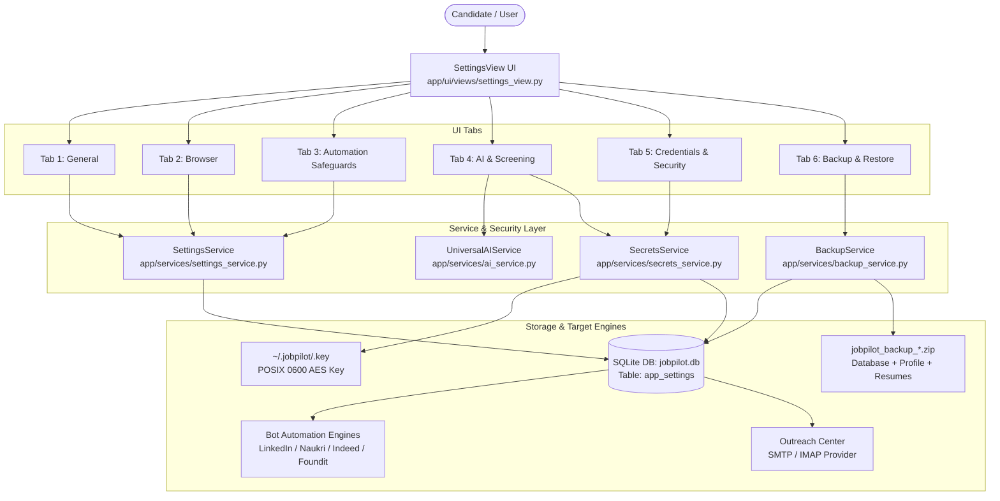
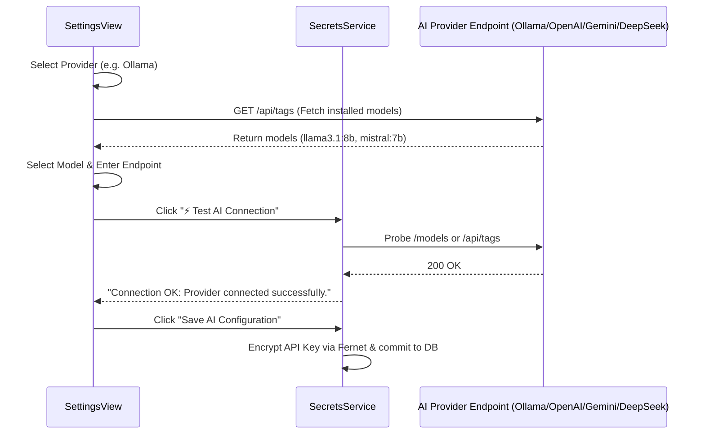
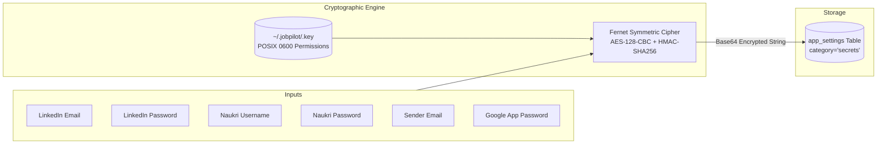

# JobPilot System Settings & Security — End-to-End Workflow Architecture (`SettingFlow.md`)

> **Repository:** `JobPilot`  
> **Component:** Settings & Security Management View (`app/ui/views/settings_view.py`)  
> **Service Layer:** `SettingsService`, `SecretsService`, `BackupService`, `UniversalAIService`  
> **Security Standard:** Machine-Specific Master Key (`~/.jobpilot/.key`, POSIX 0600), Fernet (AES-128-CBC + HMAC-SHA256)

---

## 1. High-Level Architecture Overview

The **Settings & Security** module provides a centralized control plane for the JobPilot desktop application and automated bot engines. It governs:
1. **Interaction Timings & Search Rotation** (General execution controls)
2. **Undetected Browser & Anti-Bot Stealth** (Chrome driver profiles and flags)
3. **Application Safety Gates & Human Review** (Submission safeguards)
4. **AI Screening & LLM Engine** (Ollama, OpenAI, Gemini, DeepSeek configurations)
5. **Encrypted Platform & Email Credentials** (AES-128 authenticated credential storage)
6. **Full-System Backup & Isolated Restore** (Atomic archives of DB, profile, and resumes)



---

## 2. Main Page Header & Global Controls

Located at the top of the Settings page:
- **Title:** `System Settings & Security`
- **Subtitle:** `Configure operational parameters, encrypted credentials, AI providers, and system backups.`
- **Notification Bar (`NotificationBar`):** Provides instant, colored feedback alerts:
  - 🟢 **Success:** Setting saved, connection verified, backup completed.
  - 🔴 **Danger:** Connection error, validation failure, restore error.
  - 🟡 **Warning:** Missing fields, empty inputs.
  - 🔵 **Info:** Reset confirmations, model discovery summaries.
- **Top Action Buttons:**
  - `Reset Section` (`_reset_active_tab()`): Reverts settings for the currently visible tab to defaults.
  - `Save Settings` (`_save_active_tab()`): Persists configuration for the active tab to the database.

---

## 3. Tab-by-Tab Breakdown & Subheaders

### Tab 1: General Settings

Manages runtime execution throttling, pagination, and listing discovery parameters.

| Subheader / Card | Field / Control | Type | DB Key | Default | Description |
|---|---|---|---|---|---|
| **Interaction Timing & Delays** | Action Click Delay | QSpinBox (1–10s) | `general.click_gap` | `1` sec | Throttling delay between automated clicks, selections, and button transitions to emulate human cadence and bypass behavioral anti-bot heuristics. |
| **Search Rotation & Exploration Behavior** | Enable smooth page scrolling | QCheckBox | `general.smooth_scroll` | `False` | Simulates human scroll-wheel gestures when scanning job search result cards. |
| | Run continuously in non-stop loop | QCheckBox | `general.run_non_stop` | `False` | When enabled, the bot does not terminate after reaching application limits; it resets and continues indefinitely. |
| | Alternate Recent and Relevant sort | QCheckBox | `general.alternate_sortby` | `True` | Alternates between `Most Recent` (DD) and `Most Relevant` (R) sort filters across successive keyword queries to discover both fresh and high-affinity roles. |
| | Cycle through posted date filters | QCheckBox | `general.cycle_date_posted` | `True` | Cycles through date posted filters (Past 24 Hours `r86400`, Past Week `r604800`, Past Month) to ensure total market coverage. |

*Actions:* `Reset General to Defaults`, `Save General Settings`.

---

### Tab 2: Browser Engine & Anti-Bot Stealth

Controls undetected chromedriver behavior, screen wakelocks, and profile isolation.

| Subheader / Card | Field / Control | Type | DB Key | Default | Description |
|---|---|---|---|---|---|
| **Browser Automation & Anti-Bot Engine** | Run in background (Headless) | QCheckBox | `browser.run_in_background` | `False` | Launches Chrome with `--headless=new`. Keeps window invisible; disabled by default to avoid Cloudflare/DataDome headless detection flags. |
| | Undetected stealth mode | QCheckBox | `browser.stealth_mode` | `True` | Activates `undetected-chromedriver` patching to suppress `navigator.webdriver`, automate CDC variable stripping, and pass bot challenges. |
| | Safe profile isolation | QCheckBox | `browser.safe_mode` | `True` | Runs automation within dedicated persistent directories (`~/.jobpilot-chrome-profile`, `~/.jobpilot-naukri-profile`) rather than standard user Chrome profiles. |
| | Disable browser extensions | QCheckBox | `browser.disable_extensions` | `False` | Passes `--disable-extensions` to maximize page load performance and prevent third-party extensions from intercepting DOM clicks. |
| | Prevent system display sleep | QCheckBox | `browser.keep_screen_awake` | `True` | Engages an OS wakelock thread (`wakepy` / system inhibit) during automation runs to prevent Linux/macOS sleep states from terminating active sessions. |

*Actions:* `Reset Browser to Defaults`, `Save Browser Settings`.

---

### Tab 3: Automation Safeguards & Safety Gate

Configures review checkpoints, third-party company follows, and tab lifecycle management.

| Subheader / Card | Field / Control | Type | DB Key | Default | Description |
|---|---|---|---|---|---|
| **Application Safeguards & Safety Gate** | Pause before clicking Submit (Safety Gate) | QCheckBox | `automation.pause_before_submit` | `False` | Halts execution on the final review screen of Easy Apply modals and triggers a desktop confirmation popup, allowing the candidate to inspect every answer before final submission. |
| | Pause if question cannot be answered | QCheckBox | `automation.pause_at_failed_question` | `True` | If the multi-tier QnA engine cannot resolve a screening question confidently, execution pauses for manual candidate input rather than aborting. |
| | Follow companies on Easy Apply | QCheckBox | `automation.follow_companies` | `False` | Automatically unchecks the "Follow company" checkbox on LinkedIn Easy Apply modals to keep personal feeds clean. |
| | Close external job tabs immediately | QCheckBox | `automation.close_tabs` | `False` | Closes external career portal tabs (`apply_type == EXTERNAL`) once the URL has been recorded in the database. |

*Actions:* `Reset Automation to Defaults`, `Save Automation Settings`.

---

### Tab 4: AI Screening & QnA Engine

Configures local (Ollama) or cloud (OpenAI, Gemini, DeepSeek) Large Language Models used for dynamic form screening questions and outreach email generation.



| Subheader / Card | Field / Control | Type | Storage / Key | Default | Description |
|---|---|---|---|---|---|
| **Dynamic Screening & AI QnA Engine** | Enable AI QnA Engine | QCheckBox | `ai.use_AI` | `True` | Toggles dynamic LLM fallback when rules-based and resume keyword matchers fail on screening questions. |
| | AI Provider | QComboBox | `ai.provider` | `ollama` | Available selections: `Ollama (Local LLM)`, `OpenAI (Cloud)`, `DeepSeek (Cloud)`, `Google Gemini (Cloud)`. |
| | Model Selector | QComboBox (Editable) | `ai.model` | Provider Default | Model identifier. Features auto-population per provider: <br>• **Ollama:** `llama3.1:8b`, `mistral:7b`, `qwen2.5:7b`, `phi3:mini` <br>• **OpenAI:** `gpt-4o-mini`, `gpt-4o`, `gpt-3.5-turbo`, `gpt-4-turbo` <br>• **Gemini:** `gemini-1.5-flash`, `gemini-1.5-pro`, `gemini-2.0-flash` <br>• **DeepSeek:** `deepseek-chat`, `deepseek-coder`, `deepseek-reasoner` |
| | Refresh Models (`⟳ Refresh`) | QPushButton | N/A | Visible for Ollama | Queries local Ollama daemon (`GET /api/tags`) and populates the dropdown with installed model names and their disk sizes in GB. |
| | Endpoint URL | QLineEdit | `ai.api_url` | Per Provider | API Base URL: <br>• Ollama: `http://localhost:11434/v1/` <br>• OpenAI: `https://api.openai.com/v1` <br>• Gemini: `https://generativelanguage.googleapis.com` <br>• DeepSeek: `https://api.deepseek.com/v1` |
| | API Key | QLineEdit (Password) | `secret.llm_api_key` | `None` / Encrypted | Cloud provider API key. Stored encrypted at rest. Features a `Show` / `Hide` toggle. |
| **Candidate Onboarding & Setup Wizard** | Launch Setup Wizard (`🚀 Launch Setup Wizard`) | QPushButton | N/A | N/A | Re-launches the multi-step `OnboardingWizardDialog` to re-parse candidate resumes, extract personal details with AI, and calibrate default compensation, experience, and authorization answers. |

*Actions:* 
- `⚡ Test AI Connection`: Sends a non-intrusive probe to the configured endpoint (e.g. `GET /models` with `Authorization: Bearer <key>` or `GET /api/tags`) to verify latency and authentication without writing logs.
- `Save AI Configuration`: Atomically commits provider, model, URL, and encrypted API key.

---

### Tab 5: Credentials & Security

Authoritative credential store encrypted with machine-specific AES-128-CBC / HMAC-SHA256 (Fernet) keys. Master encryption key is generated automatically on first run and stored at `~/.jobpilot/.key` with strict POSIX `0600` permissions.



#### Section A: Encrypted Platform Credentials
- **LinkedIn:**
  - `LinkedIn Email / Phone` (`secret.linkedin_username`): Account login identifier.
  - `LinkedIn Password` (`secret.linkedin_password`): Masked as `••••••••` with `Show`/`Hide` toggle.
- **Naukri:**
  - `Naukri Username` (`secret.naukri_username`): Account login email or username.
  - `Naukri Password` (`secret.naukri_password`): Masked as `••••••••` with `Show`/`Hide` toggle.

#### Section B: Recruiter Email Outreach (Gmail / Custom SMTP / IMAP)
Configures direct recruiter messaging for the **Outreach Center** and inbound reply synchronization.

| Field / Control | Type | DB Key | Default | Description |
|---|---|---|---|---|
| **Email Provider Preset** | QComboBox | `email.default.provider` | `Google Mail (Gmail)` | Pre-configures hostnames, ports, and SSL/TLS settings for: <br>• **Google Mail (Gmail):** SMTP `smtp.gmail.com:587` (TLS), IMAP `imap.gmail.com:993` (SSL) <br>• **Microsoft Outlook / O365:** SMTP `smtp.office365.com:587` (TLS), IMAP `outlook.office365.com:993` (SSL) <br>• **Custom SMTP / IMAP:** Enables arbitrary self-hosted or corporate mail servers. |
| **Sender Email Address** | QLineEdit | `email.default.user` | Profile Email | The email address displayed in the RFC 2822 `From:` header and used to authenticate against SMTP/IMAP servers. |
| **Google App Password / Secret** | QLineEdit (Password) | `email.default.password` | `None` / Encrypted | 16-character dedicated application password (for 2FA-enabled accounts). Never stored in plain text. |
| **SMTP Host & Port** | QLineEdit & QSpinBox | `email.default.smtp_host`<br>`email.default.smtp_port` | `smtp.gmail.com`<br>`587` | Outbound mail server and submission port (587 STARTTLS / 465 SSL). |
| **IMAP Host & Port** | QLineEdit & QSpinBox | `email.default.imap_host`<br>`email.default.imap_port` | `imap.gmail.com`<br>`993` | Inbound synchronization server and port (993 SSL) used to poll recruiter replies. |

*Actions:*
- **`⚡ Test Email Connection` (`EmailTestWorker`):** Spawns an asynchronous background worker that initializes standard SMTP (`STARTTLS` + authentication) and IMAP (`SSL` + login) connections to verify complete two-way mail functionality.
- **`Save Encrypted Credentials`:** Persists all secrets into `app_settings` under encrypted JSON envelopes: `{"encrypted": "<fernet_token>"}`.

---

### Tab 6: Backup & System Restore

Automated backup generator, verification engine, and staging-isolated restore workflow.

```mermaid
flowchart TD
    subgraph Backup Flow
        B_Start([Click Create Backup]) --> B_Guard{Automation Running?}
        B_Guard -- Yes --> B_Alert[Reject: Stop automation first]
        B_Guard -- No --> B_WAL[PRAGMA wal_checkpoint(TRUNCATE)]
        B_WAL --> B_Zip[Package Zip Archive:\n• database/jobpilot.db\n• config/profile.json\n• resumes/*\n• manifest.json with SHA-256]
        B_Zip --> B_Done[Save to jobpilot_backup_YYYYMMDD_HHMMSS.zip]
    end
    
    subgraph Restore Flow
        R_Start([Click Restore Backup]) --> R_Guard{Automation Running?}
        R_Guard -- Yes --> R_Alert[Reject: Stop automation first]
        R_Guard -- No --> R_Warn[Warning Confirmation Modal]
        R_Warn --> R_Safety[Create Pre-Restore Safety Snapshot]
        R_Safety --> R_Stage[Extract to Isolated /tmp Directory]
        R_Stage --> R_Verify{Verify Manifest & SQLite Header?}
        R_Verify -- Corrupt --> R_Fail[Abort Restore & Restore Safety Copy]
        R_Verify -- Valid --> R_Commit[Atomically Replace DB, Profile & Resumes]
        R_Commit --> R_Reload[Reload UI Settings & Repositories]
    end
```

| Subheader / Feature | Action Button | Handler | Description |
|---|---|---|---|
| **Full System Archive** | `📦 Create Backup (.zip)` | `_create_backup()` | Flushes SQLite WAL logs to disk, generates a zip file containing the complete SQLite database, `profile.json`, all stored resumes, and a cryptographic `manifest.json` containing file sizes and SHA-256 checksums. |
| **Restore from Archive** | `🔄 Restore from Backup` | `_restore_backup()` | Performs safe system restore: <br>1. Confirms user intent with safety warning modal. <br>2. Automatically creates a pre-restore rollback snapshot (`pre_restore_backup_*.zip`). <br>3. Stages the archive in a sandbox `/tmp` directory. <br>4. Verifies archive integrity, file checksums, and SQLite header validity. <br>5. Atomically replaces database and profile files. <br>6. Automatically triggers `load_settings()` and `load_credentials_display()` to update the UI without restarting. |
| **Profile JSON Export** | `Export Profile` | `_export_profile()` | Exports only candidate profile attributes (`personal`, `qualification`, `screening_defaults`, `search_preferences`) to standalone `profile.json`. |
| **Profile JSON Import** | `Import Profile` | `_import_profile()` | Imports candidate personal details from an external `profile.json` into the active system database and profile configuration. |

---

## 4. Cryptographic & Security Guarantees

1. **At-Rest Encryption:**
   All sensitive fields (`linkedin_password`, `naukri_password`, `llm_api_key`, `email.*.password`) are encrypted using Fernet:
   $$\text{Ciphertext} = \text{Fernet}(\text{Secret}, K_{\text{machine}})$$
   where $K_{\text{machine}}$ is a 256-bit key protected by operating system file ACLs (`0600`).
2. **Log Sanitization:**
   Plaintext passwords and API keys are strictly excluded from logging. UI representations are masked (`••••••••` or `sk-••••1234`).
3. **Fail-Secure Architecture:**
   If the Python `cryptography` library is missing or the key cannot be read, credential updates fail-fast rather than persisting secrets in plaintext.
4. **Transient Network Resilience:**
   Live connection tests (AI endpoint validation and SMTP/IMAP verification) operate with aggressive timeouts (4–10 seconds) on background `QThread` workers, preventing UI lockups.

---

## 5. Summary of Settings Key Mapping

| Configuration Key | Category | UI Tab | Default Value | Target Engine |
|---|---|---|---|---|
| `general.click_gap` | General | General | `1` | Selenium action delays |
| `general.smooth_scroll` | General | General | `False` | Discovery scroll handler |
| `general.run_non_stop` | General | General | `False` | Bot outer loop scheduler |
| `general.alternate_sortby` | General | General | `True` | Search URL generator |
| `general.cycle_date_posted` | General | General | `True` | Search URL generator |
| `browser.run_in_background` | Browser | Browser | `False` | Chrome `--headless=new` |
| `browser.stealth_mode` | Browser | Browser | `True` | `undetected-chromedriver` |
| `browser.safe_mode` | Browser | Browser | `True` | Profile isolation directory |
| `browser.disable_extensions` | Browser | Browser | `False` | Chrome `--disable-extensions` |
| `browser.keep_screen_awake` | Browser | Browser | `True` | OS Wakelock thread |
| `automation.pause_before_submit` | Automation | Automation | `False` | Submission review gate |
| `automation.pause_at_failed_question` | Automation | Automation | `True` | QnA fallback modal |
| `automation.follow_companies` | Automation | Automation | `False` | Easy Apply checkbox cleaner |
| `automation.close_tabs` | Automation | Automation | `False` | Tab cleanup routine |
| `ai.use_AI` | AI | AI & Screening | `True` | Universal QnA Engine |
| `ai.provider` | AI | AI & Screening | `"ollama"` | LLM client dispatcher |
| `ai.model` | AI | AI & Screening | `"llama3.1:8b"` | Model completion payload |
| `ai.api_url` | AI | AI & Screening | `"http://localhost:11434/v1/"` | Model HTTP endpoint |
| `secret.llm_api_key` | Secrets | AI & Screening | `None` (Encrypted) | AI Authorization header |
| `secret.linkedin_username` | Secrets | Credentials | `None` (Encrypted) | LinkedIn login bot |
| `secret.linkedin_password` | Secrets | Credentials | `None` (Encrypted) | LinkedIn login bot |
| `secret.naukri_username` | Secrets | Credentials | `None` (Encrypted) | Naukri login bot |
| `secret.naukri_password` | Secrets | Credentials | `None` (Encrypted) | Naukri login bot |
| `email.default.user` | Secrets | Credentials | Profile Email | Outreach SMTP/IMAP |
| `email.default.password` | Secrets | Credentials | `None` (Encrypted) | Outreach SMTP/IMAP |
| `email.default.smtp_host` | Secrets | Credentials | `"smtp.gmail.com"` | Outreach SMTP dispatch |
| `email.default.smtp_port` | Secrets | Credentials | `587` | Outreach SMTP dispatch |
| `email.default.imap_host` | Secrets | Credentials | `"imap.gmail.com"` | Outreach reply sync |
| `email.default.imap_port` | Secrets | Credentials | `993` | Outreach reply sync |
