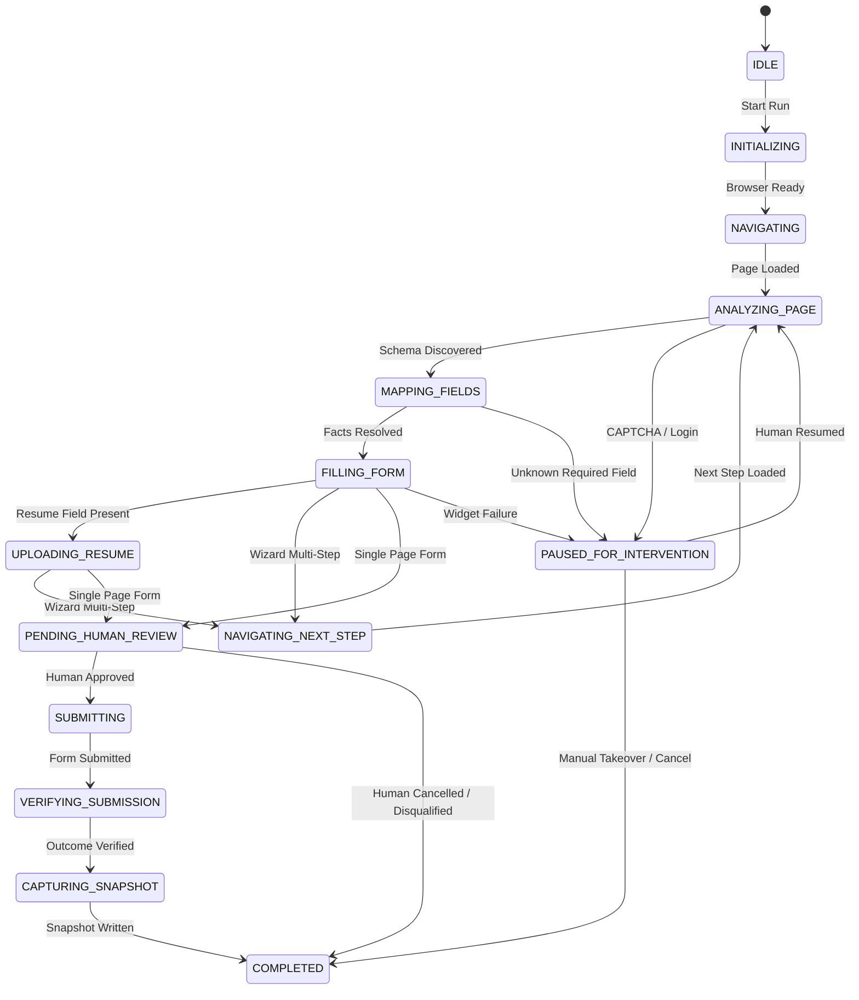

# Universal AI Application Agent — System Architecture & Workflow

## 1. Overview & Core Philosophy

The **Universal AI Application Agent** in JobPilot automates job application completion on arbitrary external ATS portals (Greenhouse, Lever, Workday, Ashby, Taleo, iCIMS, SmartRecruiters, custom company career portals) using semantic element understanding and Stagehand-powered browser execution.

### Architectural Invariants:
1. **Decoupled Qualification vs Application:** Discovery and scoring occur upstream; the Universal Agent begins at `APPLICATION_STARTED` / `READY_TO_APPLY`.
2. **Zero-Hallucination Form Filling:** All form field values map directly to verified candidate facts with cryptographic provenance (`PROFILE_FACT`, `RESUME_FACT`, `QNA_RULE`). Unverified fields trigger cooperative interventions.
3. **V1 Mandatory Human Review Gate:** In version 1.0, automatic final submission is strictly prohibited. The agent populates all fields, pauses with visual and tabular diffs, and awaits explicit candidate confirmation (`PENDING_HUMAN_REVIEW` $\rightarrow$ `SUBMITTING`).
4. **No Bot Evasion / CAPTCHA Bypass:** The agent does not employ CAPTCHA bypass libraries. Upon detecting security challenges, Cloudflare turnstiles, or login walls, it triggers an immediate cooperative pause (`PAUSED_FOR_INTERVENTION`), keeping the browser session focused for human resolution.
5. **Immutable Cryptographic Audit Trail:** Every application attempt captures a visual screenshot (`submission_screenshot.png`), DOM outerHTML (`submission_dom.html`), and computes a SHA-256 content hash (`audit_hash`) stored alongside reference numbers.

---

## 2. Complete State Machine Lifecycle

The agent's deterministic state machine enforces strict linear progression with comprehensive error handling:



---

## 3. Subsystem Breakdown

### 3.1 Generic Page Analyzer (`PageAnalyzer`)
- Inspects live DOM outerHTML and accessibility trees without hardcoded site selectors.
- Extracts form controls: `<input>`, `<select>`, `<textarea>`, custom ARIA inputs, file uploaders.
- Detects security barriers: Cloudflare Turnstile, hCaptcha, reCAPTCHA, SSO login barriers.
- Detects form topology: single-page vs. multi-step wizard step indicators and action buttons.

### 3.2 Semantic Field Mapper (`SemanticFieldMapper`)
- Maps discovered fields to candidate profile facts using multi-tier resolution:
  1. Exact attribute matching (`name`, `id`, `autocomplete`, `data-testid`).
  2. Label and ARIA description normalization.
  3. LLM semantic classification (via local Ollama / OpenAI / Gemini).
- Verifies required vs. optional fields:
  - If a required field is unresolved $\rightarrow$ Triggers `UNKNOWN_REQUIRED_FIELD` intervention.
  - If an optional field is unresolved $\rightarrow$ Skips without blocking.

### 3.3 Form Filler & File Uploader (`FormFiller`, `FileUploader`)
- Form filler executes atomic input actions with realistic typing delays.
- Option matchers resolve fuzzy `<select>` options, radio groups, and custom dropdowns.
- `FileUploader` locates `<input type="file">` elements, sets PDF payload paths, and verifies file attachment validation in the DOM.

### 3.4 V1 Human Review Gate (`UniversalReviewDialog` & CLI Prompts)
- Displays structured table of all filled inputs with provenances.
- Provides 3 candidate decisions:
  - **[Confirm & Submit]:** Proceeds to final submission click and verification.
  - **[Manual Takeover]:** Keeps browser open, disengages automation, and marks application as `MANUAL_REQUIRED`.
  - **[Cancel]:** Aborts without submitting, marking run as `USER_CANCELLED`.

### 3.5 Result Verifier & Audit Snapshot Recorder (`ResultVerifier`, `SnapshotRecorder`)
- Inspects post-submission DOM for success banners, confirmation messages, and reference numbers (e.g. `GH-CONF-...`, `WD-CONF-...`).
- Captures visual PNG proof and full DOM dump.
- Generates SHA-256 cryptographic digest of screenshot + DOM + URL + reference number.

---

## 4. Execution Entrypoints

### 4.1 CLI Supervised Alpha Runner
```bash
# Pre-flight diagnostic check
.venv/bin/python scripts/run_universal_alpha.py --check-config

# Run against real company URL with visible browser
.venv/bin/python scripts/run_universal_alpha.py --url "https://boards.greenhouse.io/company/jobs/12345"

# Run against local test harness headlessly with auto-confirmation
.venv/bin/python scripts/run_universal_alpha.py --test-harness --headless --auto-confirm
```

### 4.2 Multi-Platform Bot CLI Integration
```bash
# Run universal platform automation
.venv/bin/python runAiBot.py --platform universal --url "https://jobs.lever.co/company/job-id"
```

### 4.3 Desktop GUI Automation View
- Integrated into the Desktop UI Automation View.
- Interactive modal popups for `UniversalReviewDialog` and `UniversalInterventionDialog`.
- Real-time step progress visualized on `UniversalTimelineWidget`.

---

## 5. Security & Isolation

- **Browser Profile Isolation:** Runs in dedicated persistent profile directory `~/.jobpilot-universal-profile`.
- **Automatic Lock Cleanup:** Automatically recovers stale `SingletonLock` symlinks to prevent code 21 crashes.
- **Feature Flag Control:** `enable_universal_agent` in `SettingsService` allows instant operational kill-switch without code modifications.
