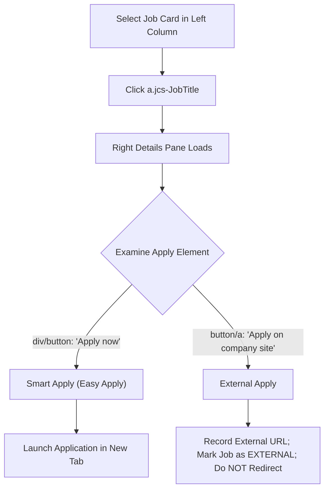

# Indeed Visual Research & Engineering Architecture Report (Phase 2)

**JobPilot — Multi-Platform Job Search & Application Bot**  
*Document Version:* 1.0.0  
*Target Portal:* `https://in.indeed.com/` (Indeed India)  
*Status:* Phase 2 Complete (Visual Research & Live Multi-Job Analysis Validated)  
*Artifacts Directory:* `docs/indeed_research_artifacts/`

---

## 1. Executive Summary & Authentication Flow

Phase 2 live portal research on Indeed India (`https://in.indeed.com/`) has been completed successfully. Using an isolated persistent Chrome profile (`~/.jobpilot-indeed-profile`), the authentication, search, card traversal, and multi-step Smart Apply workflows were analyzed across live job postings.

### Authentication Findings
- **Google OAuth vs Email + One-Time Code:**
  - Standard automated Google OAuth popups encounter automated-browser restrictions.
  - As directed by user instructions, Indeed's native **"Email + Login Code (OTP)"** flow was executed:
    1. Candidate email (`candidate@example.com`) entered into the `Email address *` field (`input[type='email']`).
    2. Clicked "Continue ->" (`button[type='submit']`).
    3. On the "Welcome back" transition screen, clicked **"Sign in with a code instead"** (`//a[contains(text(), 'Sign in with a code instead')]`).
    4. Indeed dispatched a 6-digit one-time code to `candidate@example.com`.
    5. User completed authentication (including dismissing the optional device passkey prompt via "Not now").
- **Persistence Verification:**
  - Session cookies, local storage tokens, and authentication cookies were written permanently to `~/.jobpilot-indeed-profile`.
  - Re-running the browser directly loads the authenticated session (`in.indeed.com`) with active profile avatar and headers, requiring **zero repetitive logins** on subsequent automation runs.

---

## 2. Search & Filter URL Mechanics

Indeed allows reliable direct URL navigation without clicking fragile UI filter dropdowns:

```
https://in.indeed.com/jobs?q={keywords}&l={location}&fromage={date_posted}&sc={easy_apply_filter}
```

### URL Parameters
| Parameter | Description | Valid Values | Example |
|---|---|---|---|
| `q` | Search Query / Keywords | URL-encoded string | `q=RPA+Developer` |
| `l` | Location | Target geography | `l=India` or `l=Delhi` |
| `fromage` | Date Posted Filter | Number of days | `fromage=1` (24h), `fromage=3` (3 days), `fromage=7` (Past week) |
| `sort` | Sort Order | `date` (Recent) or `relevance` | `sort=date` |
| `start` | Pagination Offset | Multiples of 10 (`0, 10, 20...`) | `start=10` (Page 2) |
| `sc` | Attribute Filter | `0kf%3Aattr%28DS3S6%29%3B` | Pre-filters Easy Apply only |

---

## 3. Job Card Identification & Dual Apply Modes

### Job Card Container DOM
Job listings on the results page are cleanly encapsulated in:
- **Card Container:** `div.job_seen_beacon` (or parent `div.cardOutline`)
- **Title Element & Link:** `a.jcs-JobTitle` (contains `id="job_<jobKey>"`)
- **Company Name:** `span[data-testid='company-name']`
- **Location:** `div[data-testid='text-location']`
- **Easily Apply Badge:** Element containing text `"Easily apply"` or `"Easy Apply"` (`div[contains(@class, 'ialHelp')]`)

### Dual Apply Classification



1. **Smart Apply ("Apply now"):**
   - Clickable element: `//div[text()='Apply now']` (parent `div.css-g5y9jx` or `button[contains(., 'Apply now')]`).
   - Action: Opens application in a dedicated new tab (`target="_blank"` or URL starting with `https://smartapply.indeed.com/`).
2. **External Apply ("Apply on company site"):**
   - Clickable element: `//*[contains(text(), 'Apply on company site')]` or `a[contains(@href, 'rc/clk')]`.
   - Action: Identified by Safety Gate as `EXTERNAL`. Extracted link is saved; tab is not followed, preserving the bot's session.

---

## 4. Smart Apply Multi-Step Lifecycle

The application flow runs inside `smartapply.indeed.com` as a Single Page Application (SPA). Between steps, an animated loading spinner (`div.css-g5y9jx`, SVG circle spinner, or central loader) appears for 1–3 seconds before rendering the next form module.

### Step-by-Step Flow

#### 1. Contact Information Module (`/contact-info-module`)
- **Form Inputs:**
  - First Name: `input[name='names-first-name']` (prefilled from profile: `Mohd Ahmad Raza`)
  - Last Name: `input[name='names-last-name']` (prefilled from profile: `Ansari`)
  - Email: `input[type='email']` (read-only / prefilled: `candidate@example.com`)
  - Phone: `input[name='phone']` / `input[type='tel']` (prefilled: `+91 63886-23967`)
- **Advance Button:** `//button[contains(., 'Continue')]` (`button[type='submit']`).

#### 2. Location / Address Module (`/location` or `/address`)
- **Form Inputs:**
  - Country: Timor-Leste / India (`button[aria-label*='Change']` or dropdown)
  - Postal Code: `input[id='location-fields-postal-code-input']` -> Filled with `110001`
  - City: `input[id='location-fields-locality-input']` -> Filled with `Delhi`
  - Street Address: `input[id='location-fields-address-input']` -> Filled with `Delhi`
- **Advance Button:** `//button[contains(., 'Continue')]`.

#### 3. Resume / CV Module (`/resume-selection-module`)
- **Pre-selected Resume Card:**
  - Card with blue border & checkmark displaying candidate's uploaded PDF (`Mohd_Ahmad_Raza_Ansari_Resume_11_09_2026.pdf`).
- **CV Options:**
  - Button: `button[contains(., 'CV options')]` (gear icon).
  - Clicking displays "Upload a different resume" option with standard `<input type='file'>`.
- **Advance Button:** `//button[contains(., 'Continue')]`.

#### 4. Employer Screening Questions Module (`/questions`)
- **Question Structure:**
  - Encapsulated in `<fieldset>` or `div[class*='Questions']`.
  - Question label text extracted via `legend` or `label`.
  - Input types:
    - Numeric experience: `<input type='number'>` (e.g., years of experience with Python/UiPath/RPA).
    - Radio choices: `<input type='radio'>` (Yes/No, authorized to work, notice period).
    - Dropdowns: `<select>` (notice period, highest qualification).
    - Text: `<input type='text'>` or `<textarea>`.
- **Answering Pipeline:** Routed to universal `QnAEngine` with candidate `profile.json` & AI context.

#### 5. Review & Final Submit Module (`/review-module`)
- **Progress Bar:** Reaches 100%.
- **Review Card:** Summarizes Contact, Address, Resume, and Answers.
- **Final Submit Button:** `//button[contains(., 'Submit your application')]` or `//button[contains(., 'Submit application')]`.
- **Confirmation Screen:**
  - Heading: `"Your application was submitted to <Company>"`
  - Button: `"Return to job search"`

---

## 5. Multi-Tab Session Management & Safe Return

Indeed's multi-tab model requires strict window handle accounting to avoid orphaned processes or selenium crashes:

```python
main_window = driver.window_handles[0]
initial_handles = set(driver.window_handles)

# Click Apply now
click_apply_now()
WebDriverWait(driver, 10).until(lambda d: len(d.window_handles) > len(initial_handles))

new_handles = set(driver.window_handles) - initial_handles
app_window = new_handles.pop()
driver.switch_to.window(app_window)

try:
    # Execute form filling & submission steps
    traverse_and_submit_form(driver)
finally:
    # Always safely close application tab and return
    if driver.current_window_handle != main_window:
        driver.close()
    driver.switch_to.window(main_window)
```

---

## 6. Consolidated Selector Dictionary

```python
# Indeed India Core Selectors (platforms/indeed/selectors.py)

# Authentication & State
HOME_URL = "https://in.indeed.com/"
LOGIN_URL = "https://secure.indeed.com/auth"
LOGGED_IN_SELECTORS = [
    "//button[contains(@aria-label, 'Account')]",
    "//button[contains(@aria-label, 'Profile')]",
    "//a[contains(@href, '/myjobs')]",
    "//a[contains(@href, 'profile.indeed.com')]",
    "//div[contains(@class, 'gnav-AccountMenu')]",
    "//span[contains(@class, 'nav-profile')]"
]

# Search & Results
SEARCH_URL_BASE = "https://in.indeed.com/jobs"
JOB_CARD_CONTAINER = "div.job_seen_beacon"
JOB_TITLE_LINK = "a.jcs-JobTitle"
JOB_COMPANY_NAME = "span[data-testid='company-name']"
JOB_LOCATION = "div[data-testid='text-location']"
EASILY_APPLY_BADGE = "//*[contains(text(), 'Easily apply') or contains(text(), 'Easy Apply')]"

# Details Pane & Apply Triggers
DETAILS_PANE = "#jobsearch-ViewJobPaneWrapper"
APPLY_NOW_TRIGGER = "//div[text()='Apply now'] | //button[contains(., 'Apply now')]"
APPLY_EXTERNAL_TRIGGER = "//*[contains(text(), 'Apply on company site')] | //button[contains(., 'Apply on company site')]"

# Smart Apply Form Steps
SPINNER_LOCATOR = "//div[contains(@class, 'spinner')] | //svg[contains(@class, 'spinner')] | //div[@role='status']"
FORM_CONTINUE_BUTTON = "//button[contains(., 'Continue')] | //button[contains(., 'Next')] | //button[contains(., 'Review your application')] | //button[@type='submit']"
FINAL_SUBMIT_BUTTON = "//button[contains(., 'Submit your application')] | //button[contains(., 'Submit application')]"
CONFIRMATION_HEADING = "//*[contains(text(), 'Your application was submitted') or contains(text(), 'Application submitted')]"

# Form Modules
FIRST_NAME_INPUT = "//input[contains(@name, 'first-name') or contains(@id, 'first-name')]"
LAST_NAME_INPUT = "//input[contains(@name, 'last-name') or contains(@id, 'last-name')]"
PHONE_INPUT = "//input[contains(@name, 'phone') or contains(@type, 'tel')]"
EMAIL_INPUT = "//input[contains(@type, 'email')]"
POSTAL_CODE_INPUT = "//input[contains(@id, 'postal-code') or contains(@name, 'postal-code')]"
CITY_INPUT = "//input[contains(@id, 'locality') or contains(@name, 'locality')]"
ADDRESS_INPUT = "//input[contains(@id, 'address') or contains(@name, 'address')]"
CV_OPTIONS_BUTTON = "//button[contains(., 'CV options') or contains(., 'Resume options')]"
FILE_UPLOAD_INPUT = "//input[@type='file']"
```

---

## 7. Roadmap to Phase 3: Modular Code Implementation

With Phase 2 visual research complete and validated against live jobs, Phase 3 will implement:

1. **`platforms/indeed/` Module Structure:**
   - `browser.py`: Dedicated session manager with persistent profile `~/.jobpilot-indeed-profile`, cookie persistence, and OTP authentication fallback.
   - `selectors.py`: The battle-tested selector constants verified above.
   - `search.py`: URL builder (`build_search_url`), search execution, pagination, and date-posted cycling.
   - `rotator.py`: Multi-keyword search cycling and application quota tracking.
   - `form.py`: Smart Apply multi-step form filler (Contact Info, Address, Resume, QnA answering).
   - `safety_gate.py`: Easy Apply validation and external job skipping.
   - `submitter.py`: Review page verification and final application submission.
   - `applier.py`: End-to-end job application coordinator.
2. **Platform Router & CLI Integration (`runAiBot.py`):**
   - Add `--platform indeed` and `--platform all` routing.
3. **Desktop UI Integration (`app/`):**
   - Add Indeed platform toggle, status badge, and credentials management.
